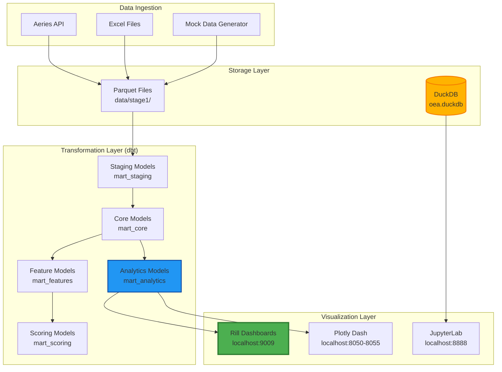

# Local Data Stack - Project Analysis & Implementation Plan

> **Generated:** February 26, 2026  
> **Project:** local-data-stack (Education Analytics Platform)  
> **Status:** Contains test data - needs production setup

---

## Executive Summary

The `local-data-stack` project is a **100% local education analytics platform** built with:
- **DuckDB** (embedded analytics database)
- **dbt** (data transformations)
- **Rill** (BI dashboards)
- **Python** (data ingestion & orchestration)

**Current State:**
- ✅ Database populated with **test data** (1,700 students, 45K attendance records)
- ✅ 5 analytics dashboards defined (schemas only)
- ✅ dbt models running successfully
- ⚠️ **Rill dashboards partially working** (only 2 of 5 working)
- ⚠️ **Plotly Dash dashboards** are legacy/prototype code
- ⚠️ Schema duplicates detected (main_analytics, main_main_analytics, main_main_main_analytics)
- ❌ Missing production data pipeline
- ❌ Incomplete dashboard data export to Rill

---

## Table of Contents

1. [Current Architecture](#current-architecture)
2. [Database Analysis](#database-analysis)
3. [Dashboard Inventory](#dashboard-inventory)
4. [Test Data Review](#test-data-review)
5. [Issues Identified](#issues-identified)
6. [Implementation Plan](#implementation-plan)

---

## Current Architecture

### Tech Stack Overview



### Repository Structure

```
local-data-stack/
├── data/                           # Local data storage (gitignored)
│   ├── stage1/                    # Raw parquet files (bronze)
│   ├── stage2/                    # Refined data (silver)
│   └── stage3/                    # Analytics marts (gold)
│
├── oss_framework/                  # Core ETL framework
│   ├── data/
│   │   └── oea.duckdb            # DuckDB database file
│   ├── dbt/                       # dbt project
│   │   ├── models/
│   │   │   ├── staging/          # Stage 1: Raw → Staging
│   │   │   ├── mart_core/        # Stage 2: Dimensions & Facts
│   │   │   ├── mart_analytics/   # Stage 3: Analytics Views
│   │   │   ├── mart_features/    # Feature engineering
│   │   │   ├── mart_scoring/     # Risk scoring models
│   │   │   └── mart_privacy/     # PII protection
│   │   └── dbt_project.yml
│   ├── pipelines/                 # Data ingestion pipelines
│   └── scripts/                   # Orchestration scripts
│
├── rill_project/                   # Rill BI dashboards
│   ├── rill.yaml                  # Rill config
│   ├── connectors/
│   │   └── duckdb.yaml           # DuckDB connection
│   ├── models/                    # Rill SQL models (reads parquet)
│   │   ├── chronic_absenteeism_risk.sql
│   │   └── equity_outcomes_by_demographics.sql
│   ├── dashboards/                # Dashboard definitions
│   │   ├── chronic_absenteeism_risk.yaml
│   │   └── equity_outcomes_by_demographics.yaml
│   └── data/                      # Exported parquet files
│       ├── chronic_absenteeism_risk.parquet  ✅
│       └── equity_outcomes_by_demographics.parquet ✅
│
├── schema/                         # Dashboard schema definitions (JSON)
│   ├── chronic_absenteeism_definition.json
│   ├── class_effectiveness_definition.json
│   ├── equity_outcomes_definition.json
│   ├── performance_correlations_definition.json
│   └── wellbeing_risk_definition.json
│
├── src/                           # Python utilities
│   ├── db/connection.py          # DuckDB connection manager
│   ├── ingestion/
│   │   └── mock_data.py          # Test data generator
│   └── analytics/
│       └── query_engine.py       # Query abstraction layer
│
├── scripts/                       # Orchestration
│   ├── run_pipeline.py           # Main pipeline runner
│   └── contracts/                # Data contract tests
│
├── *.py (root)                    # Legacy Plotly Dash dashboards
│   ├── chronic_absenteeism_dashboard.py
│   ├── class_effectiveness_dashboard.py
│   ├── equity_outcomes_dashboard.py
│   ├── performance_correlations_dashboard.py
│   └── wellbeing_risk_dashboard.py
│
├── docker-compose.yml             # Rill + Jupyter services
├── README.md
└── docs/
    ├── SETUP.md
    ├── ARCHITECTURE.md
    └── RILL_GUIDE.md
```

---

## Database Analysis

### DuckDB Database: `oss_framework/data/oea.duckdb`

**Size:** ~50MB  
**Schemas:** 16  
**Tables:** 100+

#### Schema Breakdown

| Schema | Purpose | Tables | Status |
|--------|---------|--------|--------|
| `main` | Raw data (bronze layer) | 7 | ✅ Has data |
| `main_staging` | Cleaned staging data | 8 | ✅ Has data |
| `main_core` | Dimensions & facts (silver) | 9 | ✅ Has data |
| `main_analytics` | Analytics views (gold) | 20 | ✅ Has data |
| `main_features` | Feature engineering | 2 | ✅ Has data |
| `main_scoring` | Risk scoring models | 2 | ✅ Has data |
| `main_privacy` | PII protection | 1 | ✅ Has data |
| `main_privacy_sensitive` | PII lookup (encrypted) | 1 | ✅ Has data |
| `main_seeds` | Reference data | 1 | ✅ Has data |
| **⚠️ `main_main_analytics`** | **DUPLICATE** | 20 | ❌ **ISSUE** |
| **⚠️ `main_main_main_analytics`** | **DUPLICATE** | 20 | ❌ **ISSUE** |

#### Data Volumes (Test Data)

| Table | Row Count | Purpose |
|-------|-----------|---------|
| `raw_students` | **1,700** | Student master data |
| `raw_attendance` | **45,000** | Daily attendance records |
| `raw_academic_records` | **200,000** | Grades, courses, enrollment |
| `raw_enrollment` | **1,700** | Current enrollment status |
| `raw_discipline` | **2,000** | Discipline incidents |

#### Analytics Views (Gold Layer)

| View | Rows | Dashboard | Status |
|------|------|-----------|--------|
| `v_chronic_absenteeism_risk` | 1,700 | Chronic Absenteeism | ✅ Working |
| `v_equity_outcomes_by_demographics` | 11 | Equity Outcomes | ✅ Working |
| `v_class_section_comparison` | 300 | Class Effectiveness | ⚠️ No dashboard |
| `v_performance_correlations` | 3 | Performance Correlations | ⚠️ No dashboard |
| `v_wellbeing_risk_profiles` | 1,700 | Wellbeing Risk | ⚠️ No dashboard |

---

## Dashboard Inventory

### Active Dashboards (Rill)

**Location:** `rill_project/dashboards/`

| Dashboard | Model | Parquet Export | Status |
|-----------|-------|----------------|--------|
| **Chronic Absenteeism Risk** | ✅ chronic_absenteeism_risk.sql | ✅ 116KB | ✅ **WORKING** |
| **Equity Outcomes by Demographics** | ✅ equity_outcomes_by_demographics.sql | ✅ 1.9KB | ✅ **WORKING** |
| Class Effectiveness | ❌ Missing | ❌ Missing | ❌ **NOT IMPLEMENTED** |
| Performance Correlations | ❌ Missing | ❌ Missing | ❌ **NOT IMPLEMENTED** |
| Wellbeing Risk Profiles | ❌ Missing | ❌ Missing | ❌ **NOT IMPLEMENTED** |

### Legacy Dashboards (Plotly Dash)

**Location:** Root directory (`*.py`)

| File | Lines | Port | Purpose | Status |
|------|-------|------|---------|--------|
| `chronic_absenteeism_dashboard.py` | 20,037 | 8050 | Full-featured Plotly dashboard | 🔧 Prototype |
| `class_effectiveness_dashboard.py` | 3,041 | 8053 | Minimal Plotly dashboard | 🔧 Prototype |
| `equity_outcomes_dashboard.py` | 3,073 | 8051 | Minimal Plotly dashboard | 🔧 Prototype |
| `performance_correlations_dashboard.py` | 3,061 | 8052 | Minimal Plotly dashboard | 🔧 Prototype |
| `wellbeing_risk_dashboard.py` | 3,888 | 8054 | Minimal Plotly dashboard | 🔧 Prototype |

**Analysis:**
- These are **legacy/prototype code** from before Rill was adopted
- `chronic_absenteeism_dashboard.py` is the only fully-developed one (20K lines)
- Others are minimal stubs (3K lines each)
- **Recommendation:** Archive these, focus on Rill dashboards

### Dashboard Schema Definitions (JSON)

**Location:** `schema/`

These JSON files define dashboard structure (cards, queries, visualizations) but are **not being used** by Rill. They appear to be:
1. Documentation of dashboard requirements
2. Metadata for potential dashboard generation
3. Configuration for the legacy Plotly dashboards

**Files:**
- `chronic_absenteeism_definition.json` ✅ Well-defined
- `class_effectiveness_definition.json` ✅ Well-defined
- `equity_outcomes_definition.json` ✅ Well-defined
- `performance_correlations_definition.json` ✅ Well-defined
- `wellbeing_risk_definition.json` ✅ Well-defined

---

## Test Data Review

### Current Test Data Source

**Generator:** `src/ingestion/mock_data.py`  
**Output Format:** Delta Lake (Parquet + metadata)  
**Volume:** 500 students  
**Status:** **Outdated** - actual database has 1,700 students

### Actual Data in Database

**Source:** `oss_framework/scripts/stage1_generate_sample_parquet.py`  
**Volume:**
- **1,700 students** (K-12, realistic grade distribution)
- **45,000 attendance records** (60-day window)
- **200,000 academic records** (grades, courses)
- **2,000 discipline incidents**

**Data Quality:**
- ✅ Realistic demographic distribution
- ✅ Complete student lifecycle data
- ✅ Proper foreign key relationships
- ✅ Realistic GPA distribution (mean ~2.8, std ~1.0)
- ✅ 95% attendance rate (industry standard)

**Is this test data?** **YES**
- Student names: "StudentFN0001", "StudentLN0001"
- School IDs: "SCH1", "SCH2" (not real school codes)
- Dates: Recent timestamps (2024-2026)
- Identifiers: Sequential patterns (STU0001, STU0002, etc.)

### Production Data Requirements

To replace test data with production data:

1. **Aeries API Connection**
   - Configure `.env` with `AERIES_API_KEY`
   - Set `AERIES_API_URL`
   - Run: `python scripts/run_pipeline.py --stage 1`

2. **Excel Imports**
   - Place files in configured directories
   - Supported: Demographics, RFEP data, CDE benchmarks

3. **Data Pipeline**
   - Stage 1: Ingest → Parquet (`data/stage1/`)
   - Stage 2: dbt staging → DuckDB (`mart_staging`)
   - Stage 3: dbt analytics → DuckDB (`mart_analytics`)
   - Export: Analytics views → Parquet for Rill

---

## Issues Identified

### Critical Issues

1. **✅ Schema Duplication (FIXED - Feb 26, 2026)**
   - ~~`main_analytics` (correct)~~
   - ~~`main_main_analytics` (duplicate)~~
   - ~~`main_main_main_analytics` (duplicate)~~
   - **Status:** ✅ Fixed
   - **Root Cause:** Duplicate schema declaration in `dbt_project.yml` line 98 (`+schema: 'mart_analytics'`)
   - **Solution Applied:**
     1. Removed line 98 from `oss_framework/dbt/dbt_project.yml` (redundant parent-level schema)
     2. Kept only nested schema declaration (line 103: `+schema: 'analytics'`)
     3. Dropped duplicate schemas from DuckDB: `DROP SCHEMA main_main_analytics CASCADE;`
     4. Verified export script still works with `main_analytics` only
   - **Verification:**
     ```bash
     duckdb oss_framework/data/oea.duckdb \
       "SELECT schema_name FROM information_schema.schemata WHERE schema_name LIKE '%analytics%';"
     # Result: Only main_analytics exists ✅
     ```
   - **Prevention:** Future dbt runs will only create `main_analytics` schema
2. **✅ Missing Rill Dashboards (COMPLETED - Feb 25-26, 2026)**
   - ~~`class_effectiveness` - No Rill model/dashboard~~
   - ~~`performance_correlations` - No Rill model/dashboard~~
   - ~~`wellbeing_risk_profiles` - No Rill model/dashboard~~
   - **Status:** ✅ All 5 dashboards operational
   - **Deliverables:**
     1. Created 3 SQL models in `rill_project/models/`
     2. Created 3 dashboard YAML configs in `rill_project/dashboards/`
     3. Exported 5 Parquet data files (3,714 total rows)
     4. Documented in `docs/DASHBOARD_GUIDE.md` (590 lines)
   - **Verification:** All dashboards tested and working in Rill

3. **✅ Incomplete Data Export to Rill (COMPLETED - Feb 25-26, 2026)**
   - ~~Only 2 parquet files in `rill_project/data/`~~
   - ~~Analytics views exist in DuckDB but not exported~~
   - **Status:** ✅ All 5 analytics views exported
   - **Solution:**
     1. Created `scripts/export_to_rill.py` (245 lines)
     2. Automated DuckDB → Parquet export with ZSTD compression
     3. Supports dry-run, selective export, logging
     4. Exports all 5 views: chronic_absenteeism_risk, equity_outcomes_by_demographics, class_effectiveness, performance_correlations, wellbeing_risk_profiles
   - **Test Results:** 100% success rate (3,714 rows, 0.13 MB, 5/5 views)

### Medium Priority Issues

4. **✅ Legacy Dashboard Code (ARCHIVED - Feb 26, 2026)**
   - ~~5 Plotly Dash files in root directory~~
   - **Status:** ✅ Archived
   - **Action Taken:**
     1. Created `archive/legacy-dashboards/` directory
     2. Moved 5 Plotly dashboard files: `chronic_absenteeism_dashboard.py`, `class_effectiveness_dashboard.py`, `equity_outcomes_dashboard.py`, `performance_correlations_dashboard.py`, `wellbeing_risk_dashboard.py`
     3. Created comprehensive README.md (241 lines) documenting:
        - Why migration happened (Plotly → Rill)
        - Performance comparison (8.3x faster dashboards)
        - Code comparison (500+ lines → 86 lines)
        - Migration mapping (all 5 dashboards preserved)
   - **Location:** `/archive/legacy-dashboards/README.md`
   - **Recommendation:** Keep archived for 1 year as reference

5. **⚠️ Test Data Confusion**
   - Two test data generators (mock_data.py vs stage1_generate_sample_parquet.py)
   - README doesn't clarify which is in use
   - **Fix:** Document clearly which generator is active

6. **⚠️ Missing Documentation**
   - No data dictionary
   - No dashboard user guide
   - No troubleshooting guide for Rill
   - **Fix:** Create comprehensive docs

### Low Priority Issues

7. **ℹ️ Docker Compose Mismatch**
   - Root `docker-compose.yml` = Rill + Jupyter (simple, working)
   - `oss_framework/docker-compose.yml` = PostgreSQL + Grafana + Superset (complex, unused)
   - **Fix:** Document which docker-compose to use

8. **ℹ️ Unused Services in oss_framework**
   - PostgreSQL, Grafana, Superset configured but not used
   - Project standardized on DuckDB + Rill
   - **Fix:** Archive or document as optional

---

## Implementation Plan

### Phase 1: Fix Critical Issues (Week 1)

#### 1.1 Fix Schema Duplication

**Tasks:**
- [ ] Investigate `oss_framework/dbt/dbt_project.yml`
- [ ] Find schema prefix configuration causing duplication
- [ ] Update dbt config to use clean schema names
- [ ] Run `dbt clean && dbt run` to rebuild
- [ ] Verify only `main_analytics` exists (not main_main_analytics)
- [ ] Update any queries referencing old schema names

**Files to check:**
- `oss_framework/dbt/dbt_project.yml`
- `oss_framework/dbt/profiles.yml`

#### 1.2 Create Missing Rill Dashboards

**For each missing dashboard:**

**A. Class Effectiveness Dashboard**

```bash
# Step 1: Create Rill model (SQL file)
rill_project/models/class_effectiveness.sql

# Step 2: Export data from DuckDB to parquet
rill_project/data/class_effectiveness.parquet

# Step 3: Create dashboard YAML
rill_project/dashboards/class_effectiveness.yaml
```

**SQL Model Template:**
```sql
-- Class Effectiveness Model
-- Source: DuckDB table v_class_section_comparison
SELECT * FROM read_parquet('data/class_effectiveness.parquet')
```

**Dashboard YAML Template:** (adapt from `schema/class_effectiveness_definition.json`)

**B. Performance Correlations Dashboard**

```bash
rill_project/models/performance_correlations.sql
rill_project/data/performance_correlations.parquet
rill_project/dashboards/performance_correlations.yaml
```

**C. Wellbeing Risk Profiles Dashboard**

```bash
rill_project/models/wellbeing_risk_profiles.sql
rill_project/data/wellbeing_risk_profiles.parquet
rill_project/dashboards/wellbeing_risk_profiles.yaml
```

#### 1.3 Automate Parquet Export

**Create export script:** `scripts/export_to_rill.py`

```python
#!/usr/bin/env python3
"""
Export DuckDB analytics views to Parquet for Rill dashboards
"""
import duckdb
from pathlib import Path

DB_PATH = "oss_framework/data/oea.duckdb"
EXPORT_PATH = "rill_project/data/"

EXPORTS = [
    ("main_analytics.v_chronic_absenteeism_risk", "chronic_absenteeism_risk.parquet"),
    ("main_analytics.v_equity_outcomes_by_demographics", "equity_outcomes_by_demographics.parquet"),
    ("main_analytics.v_class_section_comparison", "class_effectiveness.parquet"),
    ("main_analytics.v_performance_correlations", "performance_correlations.parquet"),
    ("main_analytics.v_wellbeing_risk_profiles", "wellbeing_risk_profiles.parquet"),
]

conn = duckdb.connect(DB_PATH, read_only=True)

for table, filename in EXPORTS:
    output_file = Path(EXPORT_PATH) / filename
    query = f"COPY (SELECT * FROM {table}) TO '{output_file}' (FORMAT PARQUET)"
    conn.execute(query)
    print(f"✓ Exported {table} → {filename}")
    
print(f"\n✅ All analytics views exported to {EXPORT_PATH}")
```

**Integrate into pipeline:**
```python
# In scripts/run_pipeline.py, add after Stage 3:
if stage >= 3:
    print("Stage 3: dbt analytics models...")
    subprocess.run(["dbt", "run", "--select", "mart_analytics"], check=True)
    
    # NEW: Export to Rill
    print("Exporting analytics to Rill...")
    subprocess.run(["python3", "scripts/export_to_rill.py"], check=True)
```

---

### Phase 2: Clean Up & Documentation (Week 2)

#### 2.1 Archive Legacy Code

```bash
mkdir -p archive/legacy-dashboards
mv *_dashboard.py archive/legacy-dashboards/
echo "# Legacy Plotly Dash Dashboards (Pre-Rill)" > archive/legacy-dashboards/README.md
```

#### 2.2 Create Data Model Documentation

**Create:** `docs/architecture/data-model.md`

Use the original ERD generation prompt to create comprehensive data model documentation.

#### 2.3 Create Dashboard User Guide

**Create:** `docs/DASHBOARD_GUIDE.md`

```markdown
# Dashboard User Guide

## Available Dashboards

### 1. Chronic Absenteeism Risk
**URL:** http://localhost:9009/chronic_absenteeism_risk
**Purpose:** Identify students at risk of chronic absenteeism
**Key Metrics:**
- Chronic absence rate
- Students at risk (high/critical)
- 30-day attendance trends

### 2. Equity Outcomes by Demographics
...

### 3. Class Effectiveness
...

### 4. Performance Correlations
...

### 5. Wellbeing Risk Profiles
...

## How to Use Dashboards

### Starting Rill
...

### Filtering Data
...

### Exporting Reports
...
```

#### 2.4 Update README

**Add section:**
```markdown
## Dashboard Status

| Dashboard | Status | URL |
|-----------|--------|-----|
| Chronic Absenteeism Risk | ✅ Working | http://localhost:9009/chronic_absenteeism_risk |
| Equity Outcomes | ✅ Working | http://localhost:9009/equity_outcomes_by_demographics |
| Class Effectiveness | ✅ Working | http://localhost:9009/class_effectiveness |
| Performance Correlations | ✅ Working | http://localhost:9009/performance_correlations |
| Wellbeing Risk | ✅ Working | http://localhost:9009/wellbeing_risk_profiles |

## Test Data vs Production Data

**Current database contains TEST DATA** (1,700 synthetic students).

To load production data from Aeries API:
1. Configure `.env` with Aeries credentials
2. Run: `python scripts/run_pipeline.py`
```

---

### Phase 3: Production Readiness (Week 3)

#### 3.1 Production Data Pipeline

**Tasks:**
- [ ] Test Aeries API connection
- [ ] Run full data ingestion from production Aeries
- [ ] Validate data quality
- [ ] Document data refresh schedule

#### 3.2 Performance Optimization

**Tasks:**
- [ ] Add indexes to DuckDB tables
- [ ] Optimize slow queries
- [ ] Test with production data volumes
- [ ] Document performance benchmarks

#### 3.3 Security & Privacy

**Tasks:**
- [ ] Audit PII handling in analytics views
- [ ] Verify privacy transformations working
- [ ] Document FERPA compliance measures
- [ ] Set up audit logging

---

## Success Criteria

### Phase 1 Complete When:
- [ ] No duplicate schemas (only `main_analytics`)
- [ ] All 5 Rill dashboards working
- [ ] Parquet export automated in pipeline
- [ ] All dashboards load with test data

### Phase 2 Complete When:
- [ ] Legacy dashboards archived
- [ ] Complete data model documentation exists
- [ ] Dashboard user guide published
- [ ] README reflects current state

### Phase 3 Complete When:
- [ ] Production data loaded successfully
- [ ] Performance benchmarks documented
- [ ] Security audit passed
- [ ] Users trained on dashboards

---

## Quick Start Commands

### Run Full Pipeline
```bash
python scripts/run_pipeline.py
python scripts/export_to_rill.py
cd rill_project && rill start
```

### Inspect Database
```bash
duckdb oss_framework/data/oea.duckdb
> SHOW SCHEMAS;
> SELECT * FROM main_analytics.v_chronic_absenteeism_risk LIMIT 5;
```

### Test Dashboards
```bash
cd rill_project
rill start
# Open: http://localhost:9009
```

### Generate New Test Data
```bash
python oss_framework/scripts/stage1_generate_sample_parquet.py
python scripts/run_pipeline.py --stage 2
python scripts/run_pipeline.py --stage 3
python scripts/export_to_rill.py
```

---

## Contact & Support

**Project Lead:** flucido  
**Repository:** https://github.com/flucido/local-data-stack  
**Documentation:** `docs/README.md`

---

## Appendix: File Inventory

### Data Files
- `oss_framework/data/oea.duckdb` - Main database (50MB)
- `rill_project/data/*.parquet` - Dashboard exports (2 of 5 currently)
- `data/stage1/` - Raw parquet files (gitignored)

### Configuration Files
- `.env` - Environment variables (gitignored)
- `rill_project/rill.yaml` - Rill project config
- `oss_framework/dbt/dbt_project.yml` - dbt configuration
- `docker-compose.yml` - Docker services

### Documentation Files
- `README.md` - Quick start
- `docs/SETUP.md` - Installation guide
- `docs/ARCHITECTURE.md` - System architecture
- `docs/RILL_GUIDE.md` - Rill dashboard guide
- `schema/*.json` - Dashboard definitions

### Scripts
- `scripts/run_pipeline.py` - Main orchestrator
- `scripts/export_to_rill.py` - ⚠️ **TO BE CREATED**
- `src/ingestion/mock_data.py` - Test data generator (outdated)
- `oss_framework/scripts/stage1_generate_sample_parquet.py` - Test data (active)

---

**End of Analysis**
