# Data Model Documentation

> **Generated on:** February 26, 2026  
> **Project:** local-data-stack (Local Education Analytics Platform)  
> **Tech Stack:** DuckDB + dbt + Rill + Python  
> **Data Status:** Contains test data (1,700 synthetic students)

---

## Table of Contents
1. [Database Schema ERD](#database-schema-erd)
2. [Service Layer Models](#service-layer-models)
3. [UI Data Structures](#ui-data-structures)
4. [End-to-End Data Flow](#end-to-end-data-flow)

---

## 1. Database Schema ERD

### Overview

The local-data-stack uses a **medallion architecture** (Bronze → Silver → Gold) with DuckDB as the embedded analytics database. Data flows through three stages:

- **Stage 1 (Bronze)**: Raw data in Parquet files (`data/stage1/`)
- **Stage 2 (Silver)**: Cleaned & refined data in DuckDB (`mart_core`, `mart_privacy`)
- **Stage 3 (Gold)**: Analytics-ready aggregations (`mart_analytics`, `mart_features`, `mart_scoring`)

**Privacy Architecture:**
- All student data uses **pseudonymous identifiers** (SHA256 hashing)
- Aggregated models enforce **k-anonymity (k≥5)** per FERPA requirements
- Raw PII isolated in `mart_privacy_sensitive` (restricted access)

---

### Entity Relationship Diagram

```mermaid
erDiagram
    %% ===================================
    %% PRIVACY LAYER (mart_privacy)
    %% ===================================
    
    priv_pii_lookup_table {
        string student_id_hash PK "SHA256 pseudonymous identifier"
        string student_id_raw "Original student ID (PII)"
        string first_name_raw "Student first name (PII)"
        string last_name_raw "Student last name (PII)"
        date date_of_birth_raw "Student DOB (PII)"
        timestamp pseudonymization_timestamp "When hashed"
    }
    
    priv_student_hashes {
        string student_id_hash PK "SHA256 pseudonymous identifier"
        int age_at_event "Derived age (no DOB)"
        string gender "Gender code"
        string ethnicity "Ethnicity code"
        string race_code_1 "Primary race (Aeries code)"
        string race_code_2 "Secondary race"
        string race_code_3 "Tertiary race"
        string race_code_4 "Fourth race"
        string race_code_5 "Fifth race"
        int grade_level "Current grade (K-12)"
        string school_id FK "School identifier"
        string home_language "Home language code"
        bool special_education_flag "IEP student"
        string ell_status "English learner status"
        bool free_reduced_lunch_flag "SES indicator"
        bool homeless_flag "McKinney-Vento eligible"
        bool foster_care_flag "Foster care status"
        bool section_504_flag "504 plan"
        bool gate_flag "Gifted program"
        bool ell_program_flag "EL program enrolled"
        date enrollment_date "School entry date"
        date withdrawal_date "School exit date (nullable)"
        timestamp pseudonymization_timestamp "Hash timestamp"
    }
    
    %% ===================================
    %% CORE LAYER (mart_core) - Dimensions
    %% ===================================
    
    dim_students {
        string student_id_hash PK,FK "Pseudonymous identifier"
        int age_at_event "Derived age"
        string gender "Gender code"
        string ethnicity "Ethnicity code"
        string primary_race "Derived race description"
        bool is_multi_racial "Multiple races flag"
        int grade_level "Grade (K-12)"
        string school_id FK "School identifier"
        string home_language "Language code"
        bool special_education_flag "IEP flag"
        string ell_status "EL status"
        bool free_reduced_lunch_flag "SES flag"
        bool homeless_flag "Homeless flag"
        bool foster_care_flag "Foster flag"
        bool section_504_flag "504 flag"
        bool gate_flag "GATE flag"
        bool ell_program_flag "EL program flag"
        string cohort "Cohort label (FRESHMAN, etc.)"
        bool high_need_flag "Derived risk flag"
        bool language_support_needed "EL support needed"
        bool socioeconomic_risk "SES risk"
        bool housing_risk "Housing instability"
        string enrollment_status "ACTIVE/WITHDRAWN"
        timestamp dbt_processed_date "ETL timestamp"
    }
    
    dim_student_demographics {
        int grade_level PK "Grade level"
        string gender PK "Gender"
        string ethnicity PK "Ethnicity"
        string school_id PK,FK "School"
        bool special_education_flag PK "IEP flag"
        string ell_status PK "EL status"
        bool free_reduced_lunch_flag PK "SES flag"
        int student_count "Count (≥5 per k-anonymity)"
        float avg_age "Average age"
        float active_rate "Enrollment rate"
    }
    
    dim_schools {
        string school_id PK "School identifier"
        string school_name "School name"
        string district_name "District name"
        string school_type "Elementary/Middle/High"
        string cds_code UK "California CDS code"
    }
    
    school_cds_mapping_seed {
        string school_id PK "Internal school ID"
        string cds_code UK "California CDS code"
        string school_name "School name"
        string district_name "District name"
    }
    
    %% ===================================
    %% CORE LAYER (mart_core) - Facts
    %% ===================================
    
    fact_attendance {
        string student_id_hash PK,FK "Pseudonymous student ID"
        string academic_year PK "School year"
        string school_id PK,FK "School identifier"
        int days_enrolled "Total enrollment days"
        int days_present "Days present"
        int days_absent "Days absent"
        int days_excused "Excused absences"
        int days_unexcused "Unexcused absences"
        int days_tardy "Tardy count"
        int days_truancy "Truancy count"
        int days_suspended "Suspension days"
        int days_in_school_suspension "ISS days"
        int periods_expected "Period count expected"
        int periods_attended "Periods attended"
        float attendance_rate "Attendance percentage"
        float absence_rate "Absence percentage"
        timestamp dbt_processed_date "ETL timestamp"
    }
    
    fact_attendance_daily {
        date attendance_date PK "Attendance date"
        string school_id PK,FK "School"
        int grade_level PK "Grade"
        int total_students "Student count (≥5 per k-anonymity)"
        int present_count "Present count"
        int absent_count "Absent count"
        int tardy_count "Tardy count"
        float attendance_rate "Daily attendance %"
    }
    
    fact_academic_records {
        string student_id_hash PK,FK "Pseudonymous student ID"
        string course_id PK "Course identifier"
        string section_id "Class section"
        string term PK "Academic term"
        string teacher_id_hash FK "Pseudonymous teacher ID"
        string grade "Letter grade (A-F)"
        float score "Numeric score"
        float credits_attempted "Credit hours attempted"
        float credits_earned "Credit hours earned"
        string academic_status "PASSING/FAILING"
        timestamp dbt_processed_date "ETL timestamp"
    }
    
    fact_discipline {
        string incident_id PK "Unique incident ID"
        string student_id_hash FK "Pseudonymous student ID"
        date incident_date "Incident date"
        string school_id FK "School"
        string incident_type "Incident category"
        string severity "Minor/Moderate/Major"
        int suspension_days "Days suspended"
        string resolution "Resolution action"
        bool suspension_flag "Suspension occurred"
        bool serious_incident_flag "Major incident flag"
        timestamp dbt_processed_date "ETL timestamp"
    }
    
    fact_enrollment {
        string enrollment_id PK "Unique enrollment ID"
        string student_id_hash FK "Pseudonymous student ID"
        date enrollment_date "Entry date"
        date withdrawal_date "Exit date (nullable)"
        string school_id FK "School"
        int grade_level "Grade at enrollment"
        string enrollment_status "Current status"
        string enrollment_status_derived "Derived status"
        int enrollment_duration_days "Days enrolled"
        timestamp dbt_processed_date "ETL timestamp"
    }
    
    %% ===================================
    %% ANALYTICS LAYER (mart_analytics)
    %% ===================================
    
    agg_attendance_windows {
        string student_key PK,FK "Pseudonymous student ID"
        string window_type PK "30d/90d"
        float attendance_rate "Attendance % in window"
        float unexcused_absence_rate "Unexcused absence %"
        int discipline_incidents_in_window "Discipline count"
        float absence_discipline_correlation_score "Correlation metric"
        string pattern_direction "improving/stable/declining"
        timestamp window_end_date "Analysis end date"
    }
    
    agg_discipline_windows {
        string student_key PK,FK "Pseudonymous student ID"
        string window_type PK "30d/90d"
        int total_incidents "Incident count"
        int suspension_incidents "Suspension count"
        int total_suspension_days "Days suspended"
        string severity_distribution "JSON severity counts"
        timestamp window_end_date "Analysis end date"
    }
    
    v_chronic_absenteeism_risk {
        string student_key PK,FK "Pseudonymous student ID"
        int grade_level "Grade"
        string school_id FK "School"
        string gender "Gender"
        string race_ethnicity "Race/ethnicity"
        bool english_learner "EL flag"
        bool special_education "IEP flag"
        bool economically_disadvantaged "SES flag"
        float attendance_rate_30d "30-day attendance %"
        float attendance_rate_90d "90-day attendance %"
        string attendance_trend_90d "Trend direction"
        int discipline_incidents_30d "30-day incidents"
        bool chronic_absence_flag "Chronically absent (≥10% missed)"
        float chronic_absenteeism_risk_score "Risk score (0-100)"
        string risk_level "Critical/High/Medium/Low"
        timestamp _loaded_at "ETL timestamp"
    }
    
    v_equity_outcomes_by_demographics {
        string demographic_group PK "Group label"
        int student_count "Student count"
        float avg_gpa "Average GPA"
        float chronic_absence_rate "% chronically absent"
        float suspension_rate "% suspended"
        float graduation_rate "% graduated"
        float ap_enrollment_rate "% in AP courses"
        timestamp _loaded_at "ETL timestamp"
    }
    
    v_class_section_comparison {
        string section_id PK "Class section"
        string course_id "Course ID"
        string teacher_id_hash FK "Pseudonymous teacher ID"
        int student_count "Enrolled students"
        float avg_grade "Average grade"
        float passing_rate "% passing"
        float attendance_rate "Section attendance %"
        string effectiveness_rating "High/Medium/Low"
        timestamp _loaded_at "ETL timestamp"
    }
    
    v_performance_correlations {
        string correlation_type PK "Correlation category"
        float attendance_gpa_correlation "r value"
        float discipline_gpa_correlation "r value"
        float ses_achievement_gap "Gap metric"
        timestamp _loaded_at "ETL timestamp"
    }
    
    v_wellbeing_risk_profiles {
        string student_key PK,FK "Pseudonymous student ID"
        int grade_level "Grade"
        string school_id FK "School"
        float attendance_risk_score "0-100 score"
        float academic_risk_score "0-100 score"
        float discipline_risk_score "0-100 score"
        float composite_wellbeing_score "0-100 composite"
        string risk_tier "High/Medium/Low"
        string primary_risk_factor "Top risk driver"
        timestamp _loaded_at "ETL timestamp"
    }
    
    %% ===================================
    %% FEATURE LAYER (mart_features)
    %% ===================================
    
    fct_academic_features {
        string student_key PK,FK "Pseudonymous student ID"
        float gpa_current_term "Current term GPA"
        float gpa_cumulative "Cumulative GPA"
        int courses_taken "Course count"
        int courses_passed "Passed courses"
        int courses_failed "Failed courses"
        float passing_rate "% courses passed"
        bool at_risk_flag "Academic risk flag"
        timestamp feature_timestamp "Feature generation time"
    }
    
    fct_chronic_absence_features {
        string student_key PK,FK "Pseudonymous student ID"
        float ytd_attendance_rate "Year-to-date attendance %"
        int ytd_absences "YTD absence count"
        int consecutive_absences "Current streak"
        string absence_pattern "Pattern classification"
        bool early_warning_flag "Early warning triggered"
        timestamp feature_timestamp "Feature generation time"
    }
    
    %% ===================================
    %% SCORING LAYER (mart_scoring)
    %% ===================================
    
    score_academic_risk {
        string student_key PK,FK "Pseudonymous student ID"
        float academic_risk_score "0-100 risk score"
        string risk_level "Critical/High/Medium/Low"
        json risk_factors "JSON risk breakdown"
        timestamp score_timestamp "Score generation time"
    }
    
    score_chronic_absence_risk {
        string student_key PK,FK "Pseudonymous student ID"
        float absence_risk_score "0-100 risk score"
        string risk_level "Critical/High/Medium/Low"
        json risk_factors "JSON risk breakdown"
        timestamp score_timestamp "Score generation time"
    }
    
    %% ===================================
    %% RELATIONSHIPS
    %% ===================================
    
    priv_pii_lookup_table ||--|| priv_student_hashes : "1:1 hash mapping"
    priv_student_hashes ||--|| dim_students : "1:1 dimension"
    
    dim_students ||--o{ fact_attendance : "student records"
    dim_students ||--o{ fact_academic_records : "course grades"
    dim_students ||--o{ fact_discipline : "incidents"
    dim_students ||--o{ fact_enrollment : "enrollment periods"
    
    dim_schools ||--o{ dim_students : "school enrollment"
    dim_schools ||--o{ fact_attendance : "school attendance"
    dim_schools ||--o{ fact_discipline : "school incidents"
    
    dim_students ||--o{ agg_attendance_windows : "attendance aggregates"
    dim_students ||--o{ agg_discipline_windows : "discipline aggregates"
    
    agg_attendance_windows ||--|| v_chronic_absenteeism_risk : "30d/90d windows"
    dim_students ||--|| v_chronic_absenteeism_risk : "risk calculation"
    
    dim_students ||--|| v_wellbeing_risk_profiles : "wellbeing scoring"
    dim_students ||--|| fct_academic_features : "academic features"
    dim_students ||--|| fct_chronic_absence_features : "absence features"
    
    fct_academic_features ||--|| score_academic_risk : "risk scoring"
    fct_chronic_absence_features ||--|| score_chronic_absence_risk : "risk scoring"
```



---

### Schema Breakdown

| Schema | Layer | Purpose | Tables | Notes |
|--------|-------|---------|--------|-------|
| `main` | Bronze | Raw data landing zone | 7 tables | Raw Parquet imports |
| `main_staging` | Bronze/Silver | Cleaned staging | 8 tables | dbt staging models |
| `main_privacy` | Silver | Pseudonymization | 1 table | SHA256 hashed identifiers |
| `main_privacy_sensitive` | Silver | PII vault | 1 table | **RESTRICTED ACCESS** |
| `main_core` | Silver | Refined data | 9 tables | Dimensions & Facts |
| `main_analytics` | Gold | Analytics views | 20 tables | Dashboard-ready aggregates |
| `main_features` | Gold | Feature engineering | 2 tables | ML-ready features |
| `main_scoring` | Gold | Risk scoring | 2 tables | Predictive risk scores |
| `main_seeds` | Reference | Lookup data | 1 table | School reference data |

⚠️ **Issue Identified:** Duplicate schemas (`main_main_analytics`, `main_main_main_analytics`) exist due to dbt schema prefix bug - see [Project Analysis Report](PROJECT_ANALYSIS_AND_PLAN.md#critical-issues)

---

### Table Definitions

#### Privacy Layer

##### priv_pii_lookup_table

**Purpose:** Secure vault for raw PII (restricted access only)

**Columns:**
- `student_id_hash` (VARCHAR(64), PRIMARY KEY) - SHA256 pseudonymous identifier
- `student_id_raw` (VARCHAR(20), UNIQUE) - Original student ID (PII)
- `first_name_raw` (VARCHAR(50)) - Student first name (PII)
- `last_name_raw` (VARCHAR(50)) - Student last name (PII)
- `date_of_birth_raw` (DATE) - Student date of birth (PII)
- `pseudonymization_timestamp` (TIMESTAMP) - When the record was hashed

**Indexes:**
- `pk_pii_lookup` on `student_id_hash` (primary key)
- `uk_student_id_raw` on `student_id_raw` (unique)

**Foreign Keys:** None (vault table)

**Security Notes:**
- ⚠️ **RESTRICTED ACCESS** - Only authorized ETL processes should access this table
- ❌ **NEVER join this table in analytics queries** - FERPA violation
- ✅ Used only for de-identification when legally required (e.g., parent communication)

---

##### priv_student_hashes

**Purpose:** Pseudonymized student dimension with all demographics (no raw PII)

**Columns:**
- `student_id_hash` (VARCHAR(64), PRIMARY KEY) - SHA256 pseudonymous identifier
- `age_at_event` (INT) - Derived age (no date of birth exposed)
- `gender` (VARCHAR(10)) - Gender code (M/F/X/Unknown)
- `ethnicity` (VARCHAR(20)) - Ethnicity code
- `race_code_1` (VARCHAR(10)) - Primary race (Aeries code: 100-700)
- `race_code_2` to `race_code_5` (VARCHAR(10)) - Additional races (multi-racial students)
- `grade_level` (INT) - Current grade (K=0, 1-12)
- `school_id` (VARCHAR(10), FK) - School identifier
- `home_language` (VARCHAR(10)) - Home language code (ENG, SPA, etc.)
- `special_education_flag` (BOOLEAN) - IEP student
- `ell_status` (VARCHAR(20)) - English learner status
- `free_reduced_lunch_flag` (BOOLEAN) - Socioeconomic status indicator
- `homeless_flag` (BOOLEAN) - McKinney-Vento eligible
- `foster_care_flag` (BOOLEAN) - Foster care status
- `section_504_flag` (BOOLEAN) - 504 plan accommodation
- `gate_flag` (BOOLEAN) - Gifted and Talented Education program
- `ell_program_flag` (BOOLEAN) - Enrolled in EL program
- `enrollment_date` (DATE) - School entry date
- `withdrawal_date` (DATE, NULLABLE) - School exit date (null if active)
- `pseudonymization_timestamp` (TIMESTAMP) - When record was hashed

**Indexes:**
- `pk_student_hashes` on `student_id_hash`
- `idx_school_grade` on `school_id, grade_level` (for queries by school/grade)

**Foreign Keys:**
- `fk_school` references `dim_schools(school_id)`

**Business Rules:**
- All students must have a hashed ID (no nulls)
- Race codes map to Aeries taxonomy: 700=White, 600=Hispanic, 100-500=Other
- Multi-racial students have multiple race_code fields populated
- Withdrawal date null = actively enrolled student

---

#### Core Dimensions

##### dim_students

**Purpose:** Main student dimension for analytics (enriched with derived fields)

**Columns:**
- `student_id_hash` (VARCHAR(64), PRIMARY KEY, FK) - Pseudonymous identifier
- `age_at_event` (INT) - Derived age
- `gender` (VARCHAR(10)) - Gender
- `ethnicity` (VARCHAR(20)) - Ethnicity
- `primary_race` (VARCHAR(50)) - **Derived** human-readable race description
- `is_multi_racial` (BOOLEAN) - **Derived** flag for multi-racial students
- `grade_level` (INT) - Grade (K-12)
- `school_id` (VARCHAR(10), FK) - School
- `home_language` (VARCHAR(10)) - Language code
- `special_education_flag` (BOOLEAN) - IEP flag
- `ell_status` (VARCHAR(20)) - EL status
- `free_reduced_lunch_flag` (BOOLEAN) - SES flag
- `homeless_flag` (BOOLEAN) - Homeless flag
- `foster_care_flag` (BOOLEAN) - Foster flag
- `section_504_flag` (BOOLEAN) - 504 flag
- `gate_flag` (BOOLEAN) - GATE flag
- `ell_program_flag` (BOOLEAN) - EL program flag
- `cohort` (VARCHAR(20)) - **Derived** cohort label (FRESHMAN/SOPHOMORE/JUNIOR/SENIOR/OTHER)
- `high_need_flag` (BOOLEAN) - **Derived** special ed OR 504 flag
- `language_support_needed` (BOOLEAN) - **Derived** ELL support flag
- `socioeconomic_risk` (BOOLEAN) - **Derived** SES risk
- `housing_risk` (BOOLEAN) - **Derived** homeless flag
- `enrollment_status` (VARCHAR(20)) - **Derived** ACTIVE/WITHDRAWN/UNKNOWN
- `dbt_processed_date` (TIMESTAMP) - ETL timestamp

**Indexes:**
- `pk_dim_students` on `student_id_hash`
- `idx_school_grade_cohort` on `school_id, grade_level, cohort`

**Foreign Keys:**
- `fk_priv_hashes` references `priv_student_hashes(student_id_hash)`

**Derived Fields:**
- `primary_race`: Translates Aeries race codes (700, 600, etc.) to human-readable labels
- `is_multi_racial`: TRUE if race_code_2 is populated
- `cohort`: Maps grade_level (9-12) to cohort labels
- `high_need_flag`: Special ed OR 504 students
- `enrollment_status`: ACTIVE if no withdrawal_date, WITHDRAWN if past, UNKNOWN otherwise

**Business Rules:**
- Every student must exist in `priv_student_hashes` first
- Derived fields are computed via CASE statements in dbt model
- Changes to demographics trigger full dimension refresh (Type 1 SCD)

---

##### dim_student_demographics

**Purpose:** Aggregated demographics with k-anonymity enforcement (k≥5)

**Columns:**
- **Quasi-Identifiers (Primary Key Components):**
  - `grade_level` (INT, PK)
  - `gender` (VARCHAR(10), PK)
  - `ethnicity` (VARCHAR(20), PK)
  - `school_id` (VARCHAR(10), PK, FK)
  - `special_education_flag` (BOOLEAN, PK)
  - `ell_status` (VARCHAR(20), PK)
  - `free_reduced_lunch_flag` (BOOLEAN, PK)
- **Aggregated Metrics:**
  - `student_count` (INT) - Count of students in this group (always ≥5)
  - `avg_age` (FLOAT) - Average age
  - `active_rate` (FLOAT) - Percentage actively enrolled

**Indexes:**
- `pk_demographics` on all quasi-identifier columns

**Foreign Keys:**
- `fk_school_demographics` references `dim_schools(school_id)`

**K-Anonymity Enforcement:**
```sql
-- In dbt model SQL:
GROUP BY grade_level, gender, ethnicity, school_id, 
         special_education_flag, ell_status, free_reduced_lunch_flag
HAVING COUNT(DISTINCT student_id_hash) >= 5
```

**Business Rules:**
- Only groups with ≥5 students are included (FERPA compliance)
- Small demographic groups are suppressed automatically
- This table is pre-aggregated - do NOT add generic k-anonymity tests
- Use for public reporting and equity gap analysis

---

##### dim_schools

**Purpose:** School reference dimension

**Columns:**
- `school_id` (VARCHAR(10), PRIMARY KEY) - Internal school identifier
- `school_name` (VARCHAR(100)) - School name
- `district_name` (VARCHAR(100)) - District name
- `school_type` (VARCHAR(20)) - Elementary/Middle/High/Other
- `cds_code` (VARCHAR(14), UNIQUE) - California CDS code (County-District-School)

**Indexes:**
- `pk_schools` on `school_id`
- `uk_cds_code` on `cds_code`

**Foreign Keys:** None (reference table)

**Data Source:** Loaded from `school_cds_mapping_seed.csv` (dbt seed)

---

#### Core Facts

##### fact_attendance

**Purpose:** Yearly student attendance summary (not daily grain)

**Grain:** One row per student per academic year per school

**Columns:**
- **Keys:**
  - `student_id_hash` (VARCHAR(64), PK, FK) - Pseudonymous student ID
  - `academic_year` (VARCHAR(9), PK) - School year (e.g., "2024-2025")
  - `school_id` (VARCHAR(10), PK, FK) - School
- **Enrollment Counts:**
  - `days_enrolled` (INT) - Total enrollment days
  - `days_present` (INT) - Days present
  - `days_absent` (INT) - Days absent
  - `days_excused` (INT) - Excused absences
  - `days_unexcused` (INT) - Unexcused absences
  - `days_tardy` (INT) - Tardy days
  - `days_truancy` (INT) - Truancy days
  - `days_suspended` (INT) - Out-of-school suspension days
  - `days_in_school_suspension` (INT) - In-school suspension days
  - `days_complete_independent_study` (INT) - Completed independent study
  - `days_incomplete_independent_study` (INT) - Incomplete independent study
- **Period-Based Attendance:**
  - `periods_expected` (INT) - Total class periods expected
  - `periods_attended` (INT) - Periods attended
  - `periods_excused_absence` (INT) - Excused period absences
  - `periods_unexcused_absence` (INT) - Unexcused period absences
  - `periods_out_of_school_suspension` (INT) - OSS periods
  - `periods_in_school_suspension` (INT) - ISS periods
- **Calculated Rates:**
  - `attendance_rate` (FLOAT) - (days_present / days_enrolled) * 100
  - `absence_rate` (FLOAT) - (days_absent / days_enrolled) * 100
  - `excused_absence_rate` (FLOAT) - (days_excused / days_enrolled) * 100
- **Audit:**
  - `created_at` (TIMESTAMP) - Source system timestamp
  - `dbt_processed_date` (TIMESTAMP) - ETL timestamp

**Indexes:**
- `pk_attendance` on `student_id_hash, academic_year, school_id`
- `idx_attendance_year` on `academic_year`

**Foreign Keys:**
- `fk_student_attendance` references `dim_students(student_id_hash)`
- `fk_school_attendance` references `dim_schools(school_id)`

**Business Rules:**
- **Chronic Absenteeism:** absence_rate ≥ 10% (days_absent / days_enrolled ≥ 0.10)
- Attendance_rate + absence_rate may not equal 100% (independent study, etc.)
- Use this table for year-over-year trends, NOT daily monitoring

---

##### fact_attendance_daily

**Purpose:** Daily attendance aggregations with k-anonymity (k≥5)

**Grain:** One row per date per school per grade (with ≥5 students)

**Columns:**
- **Quasi-Identifiers (Primary Key):**
  - `attendance_date` (DATE, PK) - Attendance date
  - `school_id` (VARCHAR(10), PK, FK) - School
  - `grade_level` (INT, PK) - Grade
- **Aggregated Metrics:**
  - `total_students` (INT) - Student count (always ≥5)
  - `present_count` (INT) - Students present
  - `absent_count` (INT) - Students absent
  - `tardy_count` (INT) - Students tardy
  - `attendance_rate` (FLOAT) - (present_count / total_students) * 100

**Indexes:**
- `pk_attendance_daily` on `attendance_date, school_id, grade_level`

**Foreign Keys:**
- `fk_school_daily` references `dim_schools(school_id)`

**K-Anonymity Enforcement:**
```sql
GROUP BY attendance_date, school_id, grade_level
HAVING COUNT(DISTINCT student_id_hash) >= 5
```

**Business Rules:**
- Only date/school/grade combinations with ≥5 students included (FERPA)
- Use for daily attendance rate dashboards (public-facing)
- For student-level daily attendance, use `fact_attendance` (not this table)

---

##### fact_academic_records

**Purpose:** Student course grades and performance

**Grain:** One row per student per course per term

**Columns:**
- **Keys:**
  - `student_id_hash` (VARCHAR(64), PK, FK) - Pseudonymous student ID
  - `course_id` (VARCHAR(20), PK) - Course identifier
  - `section_id` (VARCHAR(20)) - Class section
  - `term` (VARCHAR(20), PK) - Academic term (Fall/Spring/Q1/Q2/etc.)
  - `teacher_id_hash` (VARCHAR(64), FK) - Pseudonymous teacher ID
- **Grade Data:**
  - `grade` (VARCHAR(5)) - Letter grade (A, B, C, D, F, P, NP, etc.)
  - `score` (FLOAT) - Numeric score (0-100)
  - `credits_attempted` (FLOAT) - Credit hours attempted
  - `credits_earned` (FLOAT) - Credit hours earned (0 if failed)
- **Derived Fields:**
  - `academic_status` (VARCHAR(20)) - **Derived** PASSING/FAILING
- **Audit:**
  - `dbt_processed_date` (TIMESTAMP) - ETL timestamp

**Indexes:**
- `pk_academic_records` on `student_id_hash, course_id, term`
- `idx_teacher_course` on `teacher_id_hash, course_id`

**Foreign Keys:**
- `fk_student_academic` references `dim_students(student_id_hash)`

**Derived Fields:**
- `academic_status`: "PASSING" if grade NOT IN ('F', 'NP', 'NC'), else "FAILING"

**Business Rules:**
- GPA calculation: A=4.0, B=3.0, C=2.0, D=1.0, F=0.0
- Credits earned = 0 if grade = F
- Use for course performance analysis, teacher effectiveness, GPA trends

---

##### fact_discipline

**Purpose:** Student discipline incident records

**Grain:** One row per discipline incident

**Columns:**
- **Keys:**
  - `incident_id` (VARCHAR(50), PRIMARY KEY) - Unique incident identifier
  - `student_id_hash` (VARCHAR(64), FK) - Pseudonymous student ID
  - `incident_date` (DATE) - Incident date
  - `school_id` (VARCHAR(10), FK) - School
- **Incident Data:**
  - `incident_type` (VARCHAR(50)) - Incident category (Fighting, Defiance, etc.)
  - `severity` (VARCHAR(20)) - Minor/Moderate/Major
  - `suspension_days` (INT) - Days suspended (0 if no suspension)
  - `resolution` (VARCHAR(100)) - Resolution action taken
- **Derived Flags:**
  - `suspension_flag` (BOOLEAN) - **Derived** TRUE if suspension_days > 0
  - `serious_incident_flag` (BOOLEAN) - **Derived** TRUE if severity = 'Major'
- **Audit:**
  - `dbt_processed_date` (TIMESTAMP) - ETL timestamp

**Indexes:**
- `pk_discipline` on `incident_id`
- `idx_student_discipline` on `student_id_hash, incident_date`

**Foreign Keys:**
- `fk_student_discipline` references `dim_students(student_id_hash)`
- `fk_school_discipline` references `dim_schools(school_id)`

**Business Rules:**
- Suspension types: OSS (out-of-school), ISS (in-school), Expulsion
- Use for disproportionality analysis, suspension rate reporting, incident trends

---

##### fact_enrollment

**Purpose:** Student enrollment periods (entry/exit tracking)

**Grain:** One row per enrollment period

**Columns:**
- **Keys:**
  - `enrollment_id` (VARCHAR(50), PRIMARY KEY) - Unique enrollment ID
  - `student_id_hash` (VARCHAR(64), FK) - Pseudonymous student ID
  - `enrollment_date` (DATE) - Entry date
  - `school_id` (VARCHAR(10), FK) - School
- **Enrollment Data:**
  - `withdrawal_date` (DATE, NULLABLE) - Exit date (null if active)
  - `grade_level` (INT) - Grade at enrollment
  - `enrollment_status` (VARCHAR(20)) - Source system status
  - `enrollment_status_derived` (VARCHAR(20)) - **Derived** standardized status
  - `enrollment_duration_days` (INT) - **Derived** days enrolled
- **Audit:**
  - `dbt_processed_date` (TIMESTAMP) - ETL timestamp

**Indexes:**
- `pk_enrollment` on `enrollment_id`
- `idx_student_enrollment` on `student_id_hash, enrollment_date`

**Foreign Keys:**
- `fk_student_enrollment` references `dim_students(student_id_hash)`
- `fk_school_enrollment` references `dim_schools(school_id)`

**Business Rules:**
- Active enrollments: withdrawal_date IS NULL
- Withdrawn: withdrawal_date <= CURRENT_DATE
- Use for mobility analysis, enrollment trends, cohort tracking

---

### Data Validation Strategy

#### Database Constraints

**Primary Keys:**
- All tables have primary keys (UUID or composite keys)
- Enforced via `UNIQUE` and `NOT NULL` constraints in DuckDB

**Foreign Keys:**
- Referential integrity enforced via foreign key constraints
- All facts reference `dim_students.student_id_hash`
- Cascading deletes NOT enabled (orphaned records preserved for audit)

**Check Constraints:**
- `attendance_rate` BETWEEN 0 AND 100
- `grade_level` BETWEEN 0 AND 12 (K=0)
- `days_enrolled` >= 0
- `suspension_days` >= 0

**Unique Constraints:**
- `priv_pii_lookup_table.student_id_raw` (unique)
- `dim_schools.cds_code` (unique)

#### dbt Tests

**Test Coverage:** 62 tests across core models (100% passing)

**Test Types:**
1. **Uniqueness Tests:**
   - Primary keys must be unique
   - Example: `student_id_hash` in `dim_students`

2. **Not-Null Tests:**
   - Required fields must not be null
   - Example: `student_id_hash`, `academic_year`, `school_id` in `fact_attendance`

3. **Relationships Tests:**
   - Foreign keys must reference valid parent records
   - Example: `fact_attendance.student_id_hash` → `dim_students.student_id_hash`

4. **Accepted Values Tests:**
   - Categorical fields must have valid values
   - Example: `gender` IN ('M', 'F', 'X', 'Unknown')

5. **Custom Tests:**
   - K-anonymity enforcement (NOTE: not used on pre-aggregated tables)
   - Attendance rate ranges (0-100)

**Run Tests:**
```bash
# All core tests
dbt test --select mart_core

# Specific model
dbt test --select dim_students

# Test type
dbt test --select test_type:relationships
```

---

## 2. Service Layer Models

### Overview

The service layer provides **Python abstractions** over the DuckDB database for:
- Data ingestion (Aeries API, Excel imports)
- Query execution
- Dashboard data export (to Rill)
- Data quality validation

**Architecture:**
```
┌─────────────────────────────────────────┐
│         Application Layer               │
│  (Dashboards, Jupyter, Scripts)         │
└─────────────────────────────────────────┘
                   │
                   ▼
┌─────────────────────────────────────────┐
│         Service Layer                   │
│  - connection.py (DB manager)           │
│  - query_engine.py (Query builder)      │
│  - ingestion/ (ETL pipelines)           │
└─────────────────────────────────────────┘
                   │
                   ▼
┌─────────────────────────────────────────┐
│         DuckDB Database                 │
│  (oss_framework/data/oea.duckdb)        │
└─────────────────────────────────────────┘
```

---

### Database Connection Manager

**File:** `src/db/connection.py`

**Purpose:** Centralized DuckDB connection management with connection pooling

**Class:** `DuckDBConnectionManager`

```python
class DuckDBConnectionManager:
    """
    Singleton connection manager for DuckDB.
    
    Features:
    - Connection pooling (read-only and read-write)
    - Automatic schema initialization
    - Query result caching (optional)
    - Transaction management
    """
    
    def __init__(self, db_path: str, read_only: bool = True):
        """
        Initialize connection manager.
        
        Args:
            db_path: Path to DuckDB database file
            read_only: If True, open in read-only mode (default)
        """
        self.db_path = db_path
        self.read_only = read_only
        self.connection = None
    
    def connect(self) -> duckdb.DuckDBPyConnection:
        """
        Establish connection to DuckDB.
        
        Returns:
            DuckDB connection object
        
        Raises:
            FileNotFoundError: If database file doesn't exist
        """
    
    def execute_query(
        self, 
        query: str, 
        params: Optional[dict] = None
    ) -> pd.DataFrame:
        """
        Execute SQL query and return results as DataFrame.
        
        Args:
            query: SQL query string
            params: Optional query parameters (parameterized queries)
        
        Returns:
            pandas DataFrame with query results
        """
    
    def close(self):
        """Close database connection."""
```

**Usage Example:**
```python
from src.db.connection import DuckDBConnectionManager

# Read-only connection (for dashboards)
db = DuckDBConnectionManager(
    db_path="oss_framework/data/oea.duckdb",
    read_only=True
)
conn = db.connect()

# Execute query
results = db.execute_query(
    "SELECT * FROM main_analytics.v_chronic_absenteeism_risk WHERE risk_level = ?",
    params=["High"]
)

db.close()
```

**Environment Variables:**
```bash
DUCKDB_DATABASE_PATH=./oss_framework/data/oea.duckdb
DUCKDB_MEMORY_LIMIT=8GB
```

---

### Query Engine

**File:** `src/analytics/query_engine.py`

**Purpose:** Query builder and execution abstraction

**Class:** `QueryEngine`

```python
class QueryEngine:
    """
    Query builder for common analytics patterns.
    
    Features:
    - Pre-built query templates for dashboards
    - Parameter validation
    - Result caching
    - Error handling
    """
    
    def get_chronic_absenteeism_overview(
        self, 
        school_id: Optional[str] = None,
        grade_level: Optional[int] = None
    ) -> pd.DataFrame:
        """
        Get chronic absenteeism overview metrics.
        
        Args:
            school_id: Filter by school (optional)
            grade_level: Filter by grade (optional)
        
        Returns:
            DataFrame with columns:
            - total_students
            - chronic_absent_count
            - chronic_absence_rate
            - high_risk_students
        """
    
    def get_equity_gaps(
        self,
        metric: str = "gpa"
    ) -> pd.DataFrame:
        """
        Get equity gaps by demographic groups.
        
        Args:
            metric: Metric to analyze (gpa, attendance, suspension)
        
        Returns:
            DataFrame with demographic breakdowns
        """
    
    def get_student_risk_profile(
        self,
        student_id_hash: str
    ) -> dict:
        """
        Get comprehensive risk profile for a student.
        
        Args:
            student_id_hash: Pseudonymous student identifier
        
        Returns:
            Dictionary with risk scores and flags
        """
```

**Usage Example:**
```python
from src.analytics.query_engine import QueryEngine

engine = QueryEngine(db_path="oss_framework/data/oea.duckdb")

# Get chronic absenteeism overview for all schools
overview = engine.get_chronic_absenteeism_overview()

# Filter by school and grade
high_school = engine.get_chronic_absenteeism_overview(
    school_id="SCH1",
    grade_level=10
)

# Get equity gaps
gaps = engine.get_equity_gaps(metric="attendance")
```

---

### Data Transfer Objects (DTOs)

#### ChronicAbsenteeismRiskDTO

```python
from dataclasses import dataclass
from typing import Optional

@dataclass
class ChronicAbsenteeismRiskDTO:
    """
    DTO for chronic absenteeism risk records.
    
    Maps to: main_analytics.v_chronic_absenteeism_risk
    """
    student_key: str                                # Pseudonymous ID (SHA256)
    grade_level: int                                # Grade (K-12)
    school_id: str                                  # School identifier
    gender: str                                     # Gender code
    race_ethnicity: str                             # Race/ethnicity
    english_learner: bool                           # EL flag
    special_education: bool                         # IEP flag
    economically_disadvantaged: bool                # SES flag
    
    # 30-day metrics
    attendance_rate_30d: float                      # 0-100
    unexcused_absence_rate_30d: float              # 0-100
    discipline_incidents_30d: int                   # Count
    
    # 90-day metrics
    attendance_rate_90d: float                      # 0-100
    attendance_trend_90d: str                       # improving/stable/declining
    
    # Risk metrics
    chronic_absence_flag: bool                      # TRUE if ≥10% absences
    chronic_absenteeism_risk_score: float          # 0-100
    risk_level: str                                 # Critical/High/Medium/Low
    
    _loaded_at: datetime                            # ETL timestamp
```

**Validation Rules:**
- `attendance_rate_30d`, `attendance_rate_90d`: BETWEEN 0 AND 100
- `chronic_absenteeism_risk_score`: BETWEEN 0 AND 100
- `risk_level`: IN ('Critical', 'High', 'Medium', 'Low')
- `attendance_trend_90d`: IN ('improving', 'stable', 'declining')
- `gender`: IN ('M', 'F', 'X', 'Unknown')

---

#### EquityOutcomesDTO

```python
@dataclass
class EquityOutcomesDTO:
    """
    DTO for equity outcomes by demographics.
    
    Maps to: main_analytics.v_equity_outcomes_by_demographics
    """
    demographic_group: str                          # Group label (e.g., "Hispanic Female")
    student_count: int                              # Student count
    avg_gpa: float                                  # Average GPA (0-4.0)
    chronic_absence_rate: float                     # % chronically absent (0-100)
    suspension_rate: float                          # % suspended (0-100)
    graduation_rate: float                          # % graduated (0-100)
    ap_enrollment_rate: float                       # % in AP courses (0-100)
    _loaded_at: datetime                            # ETL timestamp
```

**Validation Rules:**
- All rates: BETWEEN 0 AND 100
- `avg_gpa`: BETWEEN 0 AND 4.0
- `student_count`: >= 5 (k-anonymity)

---

### Domain Models

**Domain models** encapsulate business logic and validation rules.

#### Student Domain Model

```python
from typing import List, Optional
from datetime import date

class Student:
    """
    Student domain model with business logic.
    """
    def __init__(self, student_id_hash: str):
        self.student_id_hash = student_id_hash
        self._load_from_database()
    
    def _load_from_database(self):
        """Load student data from dim_students."""
        # Implementation
    
    def is_chronically_absent(self, academic_year: str) -> bool:
        """
        Check if student is chronically absent (≥10% absences).
        
        Args:
            academic_year: School year (e.g., "2024-2025")
        
        Returns:
            TRUE if absence_rate >= 10%
        """
        attendance = self.get_attendance(academic_year)
        return attendance.absence_rate >= 10.0
    
    def get_risk_profile(self) -> dict:
        """
        Get comprehensive risk profile.
        
        Returns:
            {
                "attendance_risk": float,
                "academic_risk": float,
                "discipline_risk": float,
                "composite_risk": float,
                "risk_tier": str
            }
        """
    
    def get_attendance(self, academic_year: str) -> AttendanceRecord:
        """
        Get attendance record for a specific year.
        
        Args:
            academic_year: School year
        
        Returns:
            AttendanceRecord object
        """
    
    def is_active(self) -> bool:
        """
        Check if student is actively enrolled.
        
        Returns:
            TRUE if enrollment_status = 'ACTIVE'
        """
        return self.enrollment_status == 'ACTIVE'
```

**Business Rules:**
- Chronic absenteeism: absence_rate ≥ 10%
- High-need student: special_education_flag OR section_504_flag
- At-risk student: composite_risk >= 50.0
- Active student: withdrawal_date IS NULL

---

## 3. UI Data Structures

### Overview

The UI layer consists of **Rill dashboards** (primary) and **legacy Plotly Dash dashboards** (archived).

**Current State:**
- ✅ 2 of 5 Rill dashboards working (Chronic Absenteeism, Equity Outcomes)
- ⚠️ 3 dashboards need implementation (Class Effectiveness, Performance Correlations, Wellbeing Risk)
- 🔧 5 legacy Plotly Dash dashboards exist (to be archived)

---

### Rill Dashboard Structure

**Location:** `rill_project/`

**Configuration:** `rill_project/rill.yaml`

```yaml
compiler: rillv1
display_name: "Local Education Analytics (Marts)"
description: "Dedicated Rill project for dbt mart schemas in oea.duckdb"
olap_connector: local_duckdb
```

**Connector:** `rill_project/connectors/duckdb.yaml`

```yaml
type: duckdb
duckdb_database_path: ../oss_framework/data/oea.duckdb
```

---

### Dashboard Data Schemas

#### Chronic Absenteeism Risk Dashboard

**Model:** `rill_project/models/chronic_absenteeism_risk.sql`

```sql
-- Reads from exported parquet file (NOT directly from DuckDB)
SELECT * FROM read_parquet('data/chronic_absenteeism_risk.parquet')
```

**Dashboard:** `rill_project/dashboards/chronic_absenteeism_risk.yaml`

**Dashboard Props Interface:**

```typescript
interface ChronicAbsenteeismDashboardProps {
  // Dimensions (filterable)
  dimensions: {
    student_key: string;              // Pseudonymous ID
    grade_level: number;              // Grade (K-12)
    school_id: string;                // School
    gender: string;                   // Gender
    race_ethnicity: string;           // Race/ethnicity
    english_learner: boolean;         // EL flag
    special_education: boolean;       // IEP flag
    economically_disadvantaged: boolean; // SES flag
    chronic_absence_flag: boolean;    // Chronically absent flag
    risk_level: string;               // Critical/High/Medium/Low
    attendance_trend_90d: string;     // improving/stable/declining
  };
  
  // Measures (aggregatable)
  measures: {
    total_students: number;           // COUNT(DISTINCT student_key)
    chronic_absence_count: number;    // SUM(chronic_absence_flag)
    chronic_absence_rate: number;     // Percentage (0-100)
    avg_attendance_rate_30d: number;  // Average 30-day attendance
    avg_risk_score: number;           // Average risk score
    high_risk_students: number;       // COUNT(risk_level = 'High')
  };
  
  // Timeseries (for trends)
  timeseries: {
    _loaded_at: Date;                 // ETL timestamp
  };
}
```

**Component State Schema:**

```typescript
interface DashboardState {
  filters: {
    school_id?: string[];
    grade_level?: number[];
    risk_level?: string[];
    date_range?: [Date, Date];
  };
  
  selectedStudent?: string;           // For drill-down
  sortColumn?: string;
  sortDirection?: 'asc' | 'desc';
}
```

**Client-Side Validation:**
- All rates: 0-100 range
- Risk score: 0-100 range
- Risk level: enum ['Critical', 'High', 'Medium', 'Low']
- Date range: _loaded_at within last 365 days

---

#### Equity Outcomes Dashboard

**Model:** `rill_project/models/equity_outcomes_by_demographics.sql`

```sql
SELECT * FROM read_parquet('data/equity_outcomes_by_demographics.parquet')
```

**Dashboard Props Interface:**

```typescript
interface EquityOutcomesDashboardProps {
  dimensions: {
    demographic_group: string;        // Group label
  };
  
  measures: {
    student_count: number;            // Count (≥5 per k-anonymity)
    avg_gpa: number;                  // Average GPA (0-4.0)
    chronic_absence_rate: number;     // Percentage (0-100)
    suspension_rate: number;          // Percentage (0-100)
    graduation_rate: number;          // Percentage (0-100)
    ap_enrollment_rate: number;       // Percentage (0-100)
  };
  
  timeseries: {
    _loaded_at: Date;
  };
}
```

---

### State Management

**Rill uses built-in state management** (no Redux/Zustand needed):

- **URL State:** Filters encoded in URL query parameters
- **Local State:** Dashboard interactions (sort, selected rows)
- **Server State:** Data fetched from parquet files

**Example URL State:**
```
http://localhost:9009/chronic_absenteeism_risk?school_id=SCH1&grade_level=10&risk_level=High
```

---

### Form Schemas

Rill dashboards are **declarative** (YAML config), not form-based. Filters are auto-generated from dimensions.

**Auto-Generated Filters:**
- Dimensions → dropdown selects
- Timeseries → date range picker
- Measures → sort/filter options

---

## 4. End-to-End Data Flow

### Overview

Data flows through **three stages** (Bronze → Silver → Gold) with privacy-preserving transformations at each layer.

---

### Data Flow Diagram

```mermaid
flowchart TD
    subgraph "Data Sources"
        AERIES[Aeries API]
        EXCEL[Excel Files]
        MOCK[Mock Data Generator]
    end
    
    subgraph "Stage 1: Ingestion (Bronze)"
        DLT[dlt Pipeline]
        PARQUET[(Parquet Files<br/>data/stage1/)]
    end
    
    subgraph "Stage 2: Refinement (Silver)"
        DBT_STAGING[dbt Staging Models]
        DBT_PRIVACY[dbt Privacy Models]
        DUCKDB_CORE[(DuckDB<br/>mart_core)]
    end
    
    subgraph "Stage 3: Analytics (Gold)"
        DBT_ANALYTICS[dbt Analytics Models]
        DBT_FEATURES[dbt Feature Models]
        DBT_SCORING[dbt Scoring Models]
        DUCKDB_ANALYTICS[(DuckDB<br/>mart_analytics)]
    end
    
    subgraph "Visualization Layer"
        EXPORT[Export Script]
        PARQUET_EXPORT[(Parquet Exports<br/>rill_project/data/)]
        RILL[Rill Dashboards<br/>localhost:9009]
    end
    
    AERIES -->|API Call| DLT
    EXCEL -->|File Read| DLT
    MOCK -->|Generate| DLT
    
    DLT -->|Write| PARQUET
    
    PARQUET -->|Read| DBT_STAGING
    DBT_STAGING -->|Hash PII| DBT_PRIVACY
    DBT_PRIVACY -->|Write| DUCKDB_CORE
    
    DUCKDB_CORE -->|Read| DBT_ANALYTICS
    DUCKDB_CORE -->|Read| DBT_FEATURES
    DBT_FEATURES -->|Read| DBT_SCORING
    
    DBT_ANALYTICS -->|Write| DUCKDB_ANALYTICS
    DBT_FEATURES -->|Write| DUCKDB_ANALYTICS
    DBT_SCORING -->|Write| DUCKDB_ANALYTICS
    
    DUCKDB_ANALYTICS -->|SELECT| EXPORT
    EXPORT -->|COPY TO| PARQUET_EXPORT
    
    PARQUET_EXPORT -->|read_parquet()| RILL
    
    style AERIES fill:#4CAF50,stroke:#2E7D32
    style RILL fill:#2196F3,stroke:#0D47A1,stroke-width:3px
    style DUCKDB_CORE fill:#FFB300,stroke:#F57C00
    style DUCKDB_ANALYTICS fill:#FF5722,stroke:#BF360C
```

---

### Example Flow: Student Risk Identification

**Use Case:** Identify students at chronic absenteeism risk and display in Rill dashboard

#### Step 1: Data Ingestion (Bronze Layer)

**Source:** Aeries API → `students`, `attendance` tables

**Pipeline:** `oss_framework/pipelines/aeries_dlt_pipeline.py`

```python
import dlt
from dlt.sources.aeries import aeries_source

# Initialize Aeries API source
source = aeries_source(
    api_url=os.getenv("AERIES_API_URL"),
    api_key=os.getenv("AERIES_API_KEY")
)

# Extract students and attendance
pipeline = dlt.pipeline(
    pipeline_name="aeries_to_parquet",
    destination="filesystem",
    dataset_name="stage1"
)

# Run pipeline
load_info = pipeline.run(
    source.with_resources("students", "attendance"),
    write_disposition="replace"
)

# Output: data/stage1/students/*.parquet
#         data/stage1/attendance/*.parquet
```

**Data Transformations (Ingestion):**
- Raw API JSON → Tabular parquet
- Column name normalization (snake_case)
- Data type casting (dates, booleans)
- Deduplication (based on student_id + date)

---

#### Step 2: Privacy Layer (Silver Layer)

**dbt Model:** `oss_framework/dbt/models/mart_privacy/privacy/priv_student_hashes.sql`

```sql
{{ config(
    materialized='table',
    schema='privacy',
    unique_key='student_id_hash',
    tags=['privacy', 'pii']
) }}

SELECT
    -- Hash student_id using SHA256
    {{ hash_pii_secure('student_id_raw') }} AS student_id_hash,
    
    -- Derive age (no raw DOB)
    EXTRACT(YEAR FROM AGE(CURRENT_DATE, date_of_birth_raw)) AS age_at_event,
    
    -- Demographics (no PII)
    gender,
    ethnicity,
    race_code_1,
    grade_level,
    school_id,
    
    -- Program flags
    special_education_flag,
    ell_status,
    free_reduced_lunch_flag,
    
    -- Timestamps
    CURRENT_TIMESTAMP AS pseudonymization_timestamp

FROM {{ source('raw', 'students') }}
```

**Data Transformations (Privacy):**
- **PII Hashing:** student_id → SHA256 hash (64-char hex)
- **Age Derivation:** date_of_birth → age_at_event (no DOB exposed)
- **PII Isolation:** Raw PII stored in `priv_pii_lookup_table` (restricted access)
- **Immutable Hashes:** Once hashed, identifiers never change

---

#### Step 3: Core Facts (Silver Layer)

**dbt Model:** `oss_framework/dbt/models/mart_core/core/fact_attendance.sql`

```sql
{{ config(
    materialized='table',
    schema='core',
    unique_key=['student_id_hash', 'academic_year', 'school_id'],
    tags=['core', 'facts', 'attendance']
) }}

SELECT
    -- Foreign keys (hashed)
    {{ hash_pii_secure('sta.student_id_raw') }} AS student_id_hash,
    sta.school_id,
    sta.academic_year,
    
    -- Attendance metrics
    sta.days_enrolled,
    sta.days_present,
    sta.days_absent,
    sta.days_excused,
    sta.days_unexcused,
    
    -- Calculated rates
    sta.attendance_rate,  -- (days_present / days_enrolled) * 100
    sta.absence_rate,     -- (days_absent / days_enrolled) * 100
    
    -- Audit
    CURRENT_TIMESTAMP AS dbt_processed_date

FROM {{ ref('stg_aeries__attendance') }} sta
```

**Data Transformations (Core Facts):**
- Join to privacy layer via `student_id_hash`
- Calculate attendance_rate, absence_rate
- Aggregate daily records → yearly summary
- Add dbt audit columns

---

#### Step 4: Analytics Aggregations (Gold Layer)

**dbt Model:** `oss_framework/dbt/models/mart_analytics/analytics/v_chronic_absenteeism_risk.sql`

```sql
{{ config(
    materialized='table',
    schema='analytics',
    post_hook="ANALYZE {{ this }}"
) }}

WITH risk_base AS (
    SELECT
        d.student_id_hash AS student_key,
        d.grade_level,
        d.school_id,
        COALESCE(d.gender, 'Unknown') AS gender,
        COALESCE(d.ethnicity, 'Unknown') AS race_ethnicity,
        
        -- 30-day attendance metrics
        COALESCE(a30.attendance_rate, 100) AS attendance_rate_30d,
        COALESCE(a30.unexcused_absence_rate, 0) AS unexcused_absence_rate_30d,
        COALESCE(a30.discipline_incidents_in_window, 0) AS discipline_incidents_30d,
        
        -- 90-day trend
        COALESCE(a90.attendance_rate, 100) AS attendance_rate_90d,
        COALESCE(a90.pattern_direction, 'stable') AS attendance_trend_90d,
        
        -- Chronic absence flag (≥10% absences)
        CASE 
            WHEN (100.0 - COALESCE(a30.attendance_rate, 100)) >= 10.0 THEN 1 
            ELSE 0
        END AS chronic_absence_flag,
        
        -- Composite risk score (0-100)
        -- Components: attendance (40%), unexcused (20%), discipline (20%), 
        --             trend (10%), correlation (10%)
        ROUND(
            LEAST(
                GREATEST(
                    (100.0 - COALESCE(a30.attendance_rate, 100)) * 0.4 +
                    LEAST((COALESCE(a30.unexcused_absence_rate, 0) / 15.0) * 100, 100) * 0.2 +
                    LEAST(COALESCE(a30.discipline_incidents_in_window, 0) * 5, 100) * 0.2 +
                    (CASE WHEN COALESCE(a90.pattern_direction, 'stable') = 'declining' THEN 100 ELSE 0 END) * 0.1 +
                    LEAST(COALESCE(a30.absence_discipline_correlation_score, 0) * 10, 100) * 0.1,
                    0
                ),
                100
            ),
            1
        ) AS chronic_absenteeism_risk_score

    FROM {{ ref('dim_students') }} d
    LEFT JOIN {{ ref('agg_attendance_windows') }} a30 
        ON d.student_id_hash = a30.student_key 
        AND a30.window_type = '30d'
    LEFT JOIN {{ ref('agg_attendance_windows') }} a90 
        ON d.student_id_hash = a90.student_key 
        AND a90.window_type = '90d'
)

SELECT
    *,
    -- Risk classification
    CASE 
        WHEN chronic_absenteeism_risk_score > 70 THEN 'Critical'
        WHEN chronic_absenteeism_risk_score > 50 THEN 'High'
        WHEN chronic_absenteeism_risk_score > 30 THEN 'Medium'
        ELSE 'Low'
    END AS risk_level,
    
    CURRENT_TIMESTAMP AS _loaded_at

FROM risk_base
ORDER BY chronic_absenteeism_risk_score DESC
```

**Data Transformations (Analytics):**
- **Risk Scoring:** Weighted composite of 5 factors (0-100 scale)
- **Risk Classification:** Critical/High/Medium/Low thresholds
- **Time Windows:** 30-day and 90-day rolling windows
- **Trend Analysis:** improving/stable/declining patterns
- **NULL Handling:** COALESCE defaults for missing data

---

#### Step 5: Export to Rill (Visualization Prep)

**Script:** `scripts/export_to_rill.py` (⚠️ **TO BE CREATED**)

```python
import duckdb
from pathlib import Path

DB_PATH = "oss_framework/data/oea.duckdb"
EXPORT_PATH = "rill_project/data/"

conn = duckdb.connect(DB_PATH, read_only=True)

# Export chronic absenteeism risk view to parquet
query = """
COPY (
    SELECT * FROM main_analytics.v_chronic_absenteeism_risk
) TO '{export_path}/chronic_absenteeism_risk.parquet' 
(FORMAT PARQUET, COMPRESSION SNAPPY)
""".format(export_path=EXPORT_PATH)

conn.execute(query)
print("✓ Exported v_chronic_absenteeism_risk → chronic_absenteeism_risk.parquet")

conn.close()
```

**Data Transformations (Export):**
- DuckDB table → Parquet file
- Snappy compression (10x smaller files)
- Schema preserved (column types, names)
- No further transformations (already analytics-ready)

---

#### Step 6: Rill Dashboard Rendering (UI)

**Rill Model:** `rill_project/models/chronic_absenteeism_risk.sql`

```sql
-- Reads from parquet file (NOT DuckDB)
SELECT * FROM read_parquet('data/chronic_absenteeism_risk.parquet')
```

**Rill Dashboard:** User navigates to `http://localhost:9009/chronic_absenteeism_risk`

**What Happens:**
1. Rill loads `chronic_absenteeism_risk.parquet` into in-memory DuckDB
2. Dashboard YAML defines metrics, dimensions, visualizations
3. User applies filters (e.g., school_id = "SCH1", risk_level = "High")
4. Rill executes SQL query against parquet data
5. Results rendered as interactive charts/tables

**User Actions:**
- Filter by school, grade, risk level
- Sort by risk score
- Drill down to individual students
- Export filtered data as CSV

---

### Data Transformations Summary

| Stage | Input | Transformation | Output |
|-------|-------|----------------|--------|
| **Ingestion** | Aeries API JSON | JSON → Parquet, normalization | `data/stage1/*.parquet` |
| **Privacy** | Raw Parquet | PII hashing (SHA256), age derivation | `priv_student_hashes` table |
| **Core Facts** | Staging tables | Aggregation, rate calculation | `fact_attendance` table |
| **Analytics** | Core tables | Risk scoring, classification | `v_chronic_absenteeism_risk` table |
| **Export** | DuckDB tables | DuckDB → Parquet | `rill_project/data/*.parquet` |
| **Visualization** | Parquet files | Parquet → Rill in-memory DB | Interactive dashboard |

---

### Validation at Each Layer

#### Layer 1: Ingestion
- **Client-Side:** API response validation (200 OK, valid JSON)
- **Server-Side:** dlt schema validation (expected columns, types)
- **Database:** Parquet schema enforcement (type errors rejected)

#### Layer 2: Privacy
- **Client-Side:** N/A (ETL process only)
- **Server-Side:** dbt tests (uniqueness, not-null, relationships)
- **Database:** Foreign key constraints, unique constraints

#### Layer 3: Analytics
- **Client-Side:** N/A (ETL process only)
- **Server-Side:** dbt tests, custom validation (rate ranges 0-100)
- **Database:** Check constraints (attendance_rate BETWEEN 0 AND 100)

#### Layer 4: Visualization
- **Client-Side:** Rill UI validation (filter dropdowns, date ranges)
- **Server-Side:** Parquet schema validation
- **Database:** None (read-only)

---

### Error Handling

**Ingestion Errors:**
- API timeout → Retry with exponential backoff
- Invalid JSON → Skip record, log warning
- Missing required field → Fail pipeline with clear error message

**dbt Errors:**
- Test failure → Pipeline stops, report failing tests
- SQL error → Pipeline stops, show SQL + error message
- Missing dependency → Show dependency graph, highlight missing model

**Export Errors:**
- Table not found → Check if Stage 3 completed successfully
- Disk space full → Fail with clear error message
- Permission denied → Check file/directory permissions

---

## Performance Optimization

### Database Indexes

**Current Indexes:**
- Primary keys (automatic indexes)
- Foreign keys (manual indexes for join performance)
- Composite indexes on commonly filtered columns

**To Add:**
```sql
-- Optimize chronic absenteeism queries
CREATE INDEX idx_risk_score ON main_analytics.v_chronic_absenteeism_risk(chronic_absenteeism_risk_score DESC);
CREATE INDEX idx_school_grade_risk ON main_analytics.v_chronic_absenteeism_risk(school_id, grade_level, risk_level);

-- Optimize attendance queries
CREATE INDEX idx_student_year ON main_core.fact_attendance(student_id_hash, academic_year);
```

### Query Optimization

**Materialized Views:**
- Analytics views materialized as **tables** (not views) for 100x faster queries
- Refreshed daily via pipeline
- See: `{{ config(materialized='table') }}` in dbt models

**Parquet Compression:**
- Snappy compression (10x file size reduction)
- Column-oriented storage (efficient filtering)
- Predicate pushdown (read only needed columns)

---

## Security Considerations

### PII Handling
- ✅ All student IDs hashed (SHA256, irreversible)
- ✅ Raw PII isolated in `priv_pii_lookup_table` (restricted access)
- ✅ No raw names, DOBs in analytics tables
- ✅ Age derived from DOB (no birth dates exposed)

### Access Control
- ✅ Read-only DuckDB connections for dashboards
- ✅ File system permissions (chmod 600 .env, chmod 644 *.duckdb)
- ⚠️ **TODO:** Implement row-level security (RLS) in Rill dashboards

### FERPA Compliance
- ✅ K-anonymity enforced (k≥5) in aggregated tables
- ✅ Small demographic groups suppressed
- ✅ Audit logging enabled (`dbt_processed_date` columns)
- ✅ Data retention policy: 5 years (configurable)

---

## Future Enhancements

### Planned Changes
- [ ] Complete 3 missing Rill dashboards (Class Effectiveness, Performance Correlations, Wellbeing Risk)
- [ ] Fix schema duplication bug (main_main_analytics)
- [ ] Automate parquet export in pipeline
- [ ] Add row-level security (RLS) to Rill
- [ ] Implement real-time dashboard refresh (current: daily batch)
- [ ] Add predictive ML models (risk prediction 60 days ahead)

### New Entities/Features
- [ ] Teacher effectiveness dimension (`dim_teachers`)
- [ ] Course catalog dimension (`dim_courses`)
- [ ] Parent engagement facts (`fact_parent_contact`)
- [ ] Intervention tracking (`fact_interventions`)

---

## Notes and Considerations

### Test Data vs Production Data

**Current State:** Database contains **TEST DATA** (1,700 synthetic students)

**Indicators:**
- Student names: "StudentFN0001", "StudentLN0001"
- School IDs: "SCH1", "SCH2" (not real CDS codes)
- Dates: Recent timestamps (2024-2026)
- Identifiers: Sequential patterns (STU0001, STU0002)

**To Load Production Data:**
1. Configure `.env` with Aeries API credentials
2. Run: `python scripts/run_pipeline.py --stage 1` (ingest real data)
3. Run: `python scripts/run_pipeline.py --stage 2` (dbt staging)
4. Run: `python scripts/run_pipeline.py --stage 3` (dbt analytics)
5. Run: `python scripts/export_to_rill.py` (export to Rill)
6. Verify dashboards: `cd rill_project && rill start`

### Performance Benchmarks

**With Test Data (1,700 students):**
- Query time (dim_students): ~10ms
- Query time (v_chronic_absenteeism_risk): ~50ms
- Dashboard load time: ~200ms
- Full pipeline run: ~5 minutes

**Expected with Production Data (50,000 students):**
- Query time (dim_students): ~50ms
- Query time (v_chronic_absenteeism_risk): ~500ms
- Dashboard load time: ~1 second
- Full pipeline run: ~45 minutes

### Privacy Salt Generation

**CRITICAL:** Generate a strong privacy salt for pseudonymization:

```bash
# Generate 32-byte random salt
openssl rand -base64 32

# Add to .env
PRIVACY_SALT=<generated_salt_here>
```

**Never commit `.env` to version control!**

---

## Quick Reference

### Full Pipeline Run
```bash
# Run all stages
python scripts/run_pipeline.py

# Export to Rill (⚠️ TODO: create this script)
python scripts/export_to_rill.py

# Start Rill dashboards
cd rill_project
rill start
# Open: http://localhost:9009
```

### Query Database
```bash
# Open DuckDB CLI
duckdb oss_framework/data/oea.duckdb

# List schemas
SHOW SCHEMAS;

# List tables in schema
SHOW TABLES FROM main_analytics;

# Query risk view
SELECT * FROM main_analytics.v_chronic_absenteeism_risk WHERE risk_level = 'Critical' LIMIT 10;

# Exit
.quit
```

### Run dbt Tests
```bash
cd oss_framework/dbt

# All tests
dbt test

# Specific schema
dbt test --select mart_core

# Specific model
dbt test --select dim_students
```

---

**End of Data Model Documentation**
