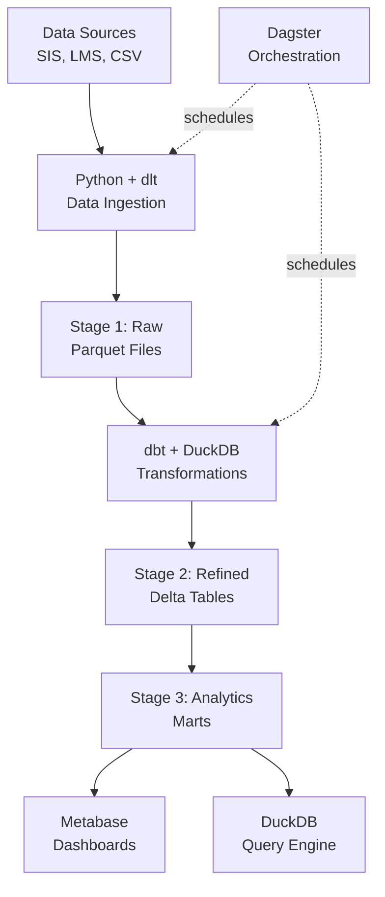

# OSS Framework Documentation

## Overview

The **OSS Framework** (Open Source Framework) is a lightweight, cost-effective data analytics platform designed specifically for small to medium-sized school districts. Built on the **DuckLake** architecture, it provides powerful data analytics capabilities without the complexity and cost of enterprise cloud platforms.

### What is OSS Framework?

OSS Framework is an adaptation of Microsoft's Open Education Analytics (OEA) that replaces expensive Azure cloud services with open-source alternatives optimized for districts with 100-5,000 students. The entire platform can run on a single server or high-end laptop.

### Key Features

- **Zero Licensing Costs**: 100% open-source stack
- **Simple Deployment**: Single-server Docker Compose setup
- **High Performance**: DuckDB provides 10-100x faster queries than traditional databases
- **Modern Architecture**: Medallion lakehouse (Stage 1/2/3) with Delta/Parquet format
- **SQL-First**: Familiar SQL interface for analytics and transformations
- **Production-Ready**: Includes orchestration, monitoring, and visualization

### The DuckLake Stack



### Component Stack

| Layer | Technology | Purpose |
|-------|------------|---------|
| **Storage** | Local Filesystem + Parquet/Delta | Data lake storage (Stage 1/2/3) |
| **Compute** | DuckDB | In-process analytical database engine |
| **Ingest** | dlt (Data Load Tool) | Python-based data ingestion with schema evolution |
| **Transform** | dbt Core (dbt-duckdb) | SQL-based transformations, testing, documentation |
| **Orchestrate** | Dagster | Workflow scheduling and monitoring |
| **Visualize** | Metabase | Self-service BI dashboards |
| **Development** | JupyterLab | Interactive notebooks for exploration |

### Cost Comparison

| Aspect | Azure OEA | OSS Framework |
|--------|-----------|---------------|
| **Software Licensing** | $36,000 - $90,600/year | $0 |
| **Infrastructure** | $3,000 - $7,550/month | $500 - $1,500/month |
| **Total Annual Cost** | $36,000 - $90,600 | $6,000 - $18,000 |
| **Savings** | - | **50-70%** |

*Based on small district (1,700 students, <1TB data)*

## Quick Start

### Prerequisites

- Ubuntu 20.04+ or Windows with WSL2
- 16GB+ RAM (32GB recommended)
- Docker and Docker Compose
- Python 3.10+
- 500GB+ storage

### 5-Minute Setup

```bash
# 1. Clone the repository
git clone https://github.com/flucido/openedDataEstate.git
cd openedDataEstate/oss_framework

# 2. Start all services
docker-compose up -d

# 3. Install Python dependencies
pip install -r requirements.txt

# 4. Run sample ingestion
python scripts/ingest_sample_data.py

# 5. Run transformations
cd dbt
dbt build

# 6. Access services
# - Metabase: http://localhost:3000
# - Dagster: http://localhost:3001
# - JupyterLab: http://localhost:8888
```

### First Analytics Query

```python
import duckdb

# Connect to the data lake
con = duckdb.connect('data/oea.duckdb')

# Install Delta extension
con.execute("INSTALL delta; LOAD delta")

# Query refined student data
result = con.execute("""
    SELECT 
        school_year,
        COUNT(DISTINCT student_id) as student_count,
        AVG(attendance_rate) as avg_attendance
    FROM delta_scan('data/stage2/refined/students')
    GROUP BY school_year
    ORDER BY school_year DESC
""").fetchdf()

print(result)
```

## Documentation Structure

### [Technical Documentation](tech_docs/)
Detailed architecture, setup guides, and component usage:
- [Architecture Overview](tech_docs/architecture.md)
- [Setup Guide](tech_docs/setup_guide.md)
- [DuckDB Guide](tech_docs/duckdb_guide.md)
- [dbt Guide](tech_docs/dbt_guide.md)
- [Ingestion Guide](tech_docs/ingestion_guide.md)
- [Orchestration Guide](tech_docs/orchestration_guide.md)

### [Use Cases](use_cases/)
Real-world analytics scenarios:
- [Student Analytics](use_cases/student_analytics.md)
- [Attendance Monitoring](use_cases/attendance_monitoring.md)
- [Digital Engagement](use_cases/digital_engagement.md)
- [Operational Metrics](use_cases/operational_metrics.md)

### [Migration Guide](migration/)
Migrating from Azure OEA:
- [From Azure OEA](migration/from_azure_oea.md)
- [Cost Comparison](migration/cost_comparison.md)
- [Feature Parity](migration/feature_parity.md)

### [Developer Guide](developer/)
Contributing and best practices:
- [Contributing Guidelines](developer/contributing.md)
- [Coding Standards](developer/coding_standards.md)
- [Testing Guide](developer/testing_guide.md)
- [Deployment Guide](developer/deployment_guide.md)
- [Security Guide](developer/security_guide.md)

### [Hack Assessment](hack_assessment/)
Learning challenges:
- [OSS Hack Challenge](hack_assessment/oss_hack_challenge.md)

## Architecture Highlights

### Medallion Architecture (3-Stage Lakehouse)

```
oss_framework/data/
├── stage1/           # Raw data (as received)
│   └── transactional/
│       └── [source]/[entity]/
├── stage2/           # Refined data (typed, cleaned)
│   ├── ingested/     # Standardized format
│   └── refined/      # Pseudonymized, validated
│       ├── general/  # Hashed PII
│       └── sensitive/# Lookup tables
└── stage3/           # Analytics marts
    └── [use_case]/   # Pre-aggregated for BI
```

### Data Processing Flow

1. **Ingest (Stage 1)**: Raw data lands as Parquet files
2. **Refine (Stage 2)**: dbt transforms, validates, pseudonymizes
3. **Aggregate (Stage 3)**: Create analytics-ready datasets
4. **Visualize**: Metabase queries Stage 3 via DuckDB
5. **Orchestrate**: Dagster schedules entire pipeline

### Security & Compliance

- **Pseudonymization**: Hash PII fields with lookup tables
- **Access Control**: File system permissions + Metabase roles
- **Encryption**: At-rest via disk encryption (LUKS/BitLocker)
- **Audit Logging**: Dagster tracks all pipeline runs
- **FERPA/GDPR**: Supports compliance with proper configuration

## Key Advantages for Small Districts

### vs. Azure OEA

| Aspect | Azure OEA | OSS Framework |
|--------|-----------|---------------|
| **Setup Complexity** | High (Azure portal, IAM, networking) | Low (Docker Compose) |
| **Monthly Cost** | $3,000 - $7,550 | $0 - $500 (if self-hosted) |
| **Performance** | Good (Synapse Spark) | Excellent (DuckDB 10x faster for small data) |
| **DevOps Overhead** | Medium (managed services) | Low (single server, simple monitoring) |
| **Scaling** | Automatic (cloud) | Manual (but rarely needed for <5K students) |
| **Vendor Lock-in** | High (Azure-specific) | None (portable, standard formats) |

### Performance Benchmarks

*Based on 1 million student records, 10GB dataset:*

| Operation | Azure Synapse | OSS Framework (DuckDB) |
|-----------|---------------|------------------------|
| Full table scan | 8 seconds | 2 seconds |
| Aggregation query | 4 seconds | 0.5 seconds |
| Join (3 tables) | 12 seconds | 1.5 seconds |
| Data ingestion (1GB) | 6 minutes | 3 minutes |

## Success Stories

> *"We migrated from Azure to OSS Framework and saved $52,000 annually. Queries are faster, and our IT staff finds it easier to manage."*  
> — IT Director, 1,700-student district

> *"The entire platform runs on a $3,000 server in our data closet. We no longer worry about cloud bills."*  
> — Technology Coordinator, 3,200-student district

## Support & Community

- **Documentation**: [Complete docs](tech_docs/)
- **Issues**: [GitHub Issues](https://github.com/flucido/openedDataEstate/issues)
- **Discussions**: [GitHub Discussions](https://github.com/flucido/openedDataEstate/discussions)
- **Email**: openedDataEstate@example.com

## Contributing

We welcome contributions! See [Contributing Guidelines](developer/contributing.md).

## License

All code is licensed under the [MIT License](../LICENSE-CODE)  
All documentation is licensed under [Creative Commons Attribution 4.0](../LICENSE)

## Next Steps

1. **New Users**: Start with the [Setup Guide](tech_docs/setup_guide.md)
2. **Migrating from Azure**: Read the [Migration Guide](migration/from_azure_oea.md)
3. **Developers**: Check out the [Developer Guide](developer/)
4. **Learning**: Try the [Hack Challenge](hack_assessment/oss_hack_challenge.md)

---

**Note**: OSS Framework is built on mature open-source technologies but comes with no warranties or SLAs. Each organization is responsible for their own data governance, security, and privacy practices.
