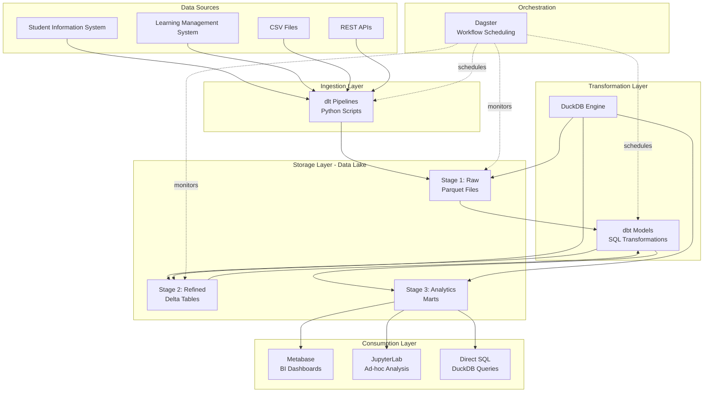
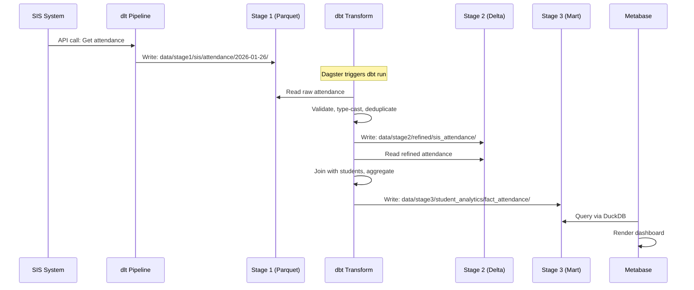
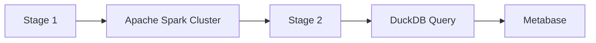
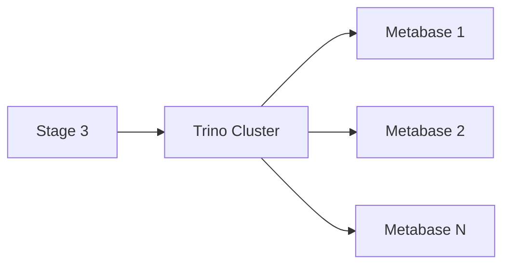

# OSS Framework Architecture

## Overview

The OSS Framework implements a modern data lakehouse architecture optimized for small to medium-sized school districts. It replaces expensive cloud services with high-performance open-source alternatives that run efficiently on a single server.

## High-Level Architecture



## Component Architecture

### 1. Data Ingestion Layer

**Technology**: dlt (Data Load Tool) + Python

**Purpose**: Extract data from sources and land in Stage 1

**Characteristics**:
- Python-based pipelines for flexibility
- Automatic schema detection and evolution
- Incremental loading with state management
- Built-in error handling and retry logic
- Support for REST APIs, databases, and files

**File Location**: `oss_framework/scripts/`

**Example Flow**:
```python
# scripts/ingest_sis.py
import dlt

@dlt.source
def sis_source():
    @dlt.resource(write_disposition="append")
    def students():
        # Fetch from SIS API
        return fetch_students_from_api()
    
    return students

# Run pipeline
pipeline = dlt.pipeline(
    pipeline_name="sis_ingestion",
    destination="filesystem",
    dataset_name="stage1_sis"
)

load_info = pipeline.run(sis_source())
```

### 2. Storage Layer: The Data Lake

**Technology**: Local Filesystem + Parquet/Delta Format

**Purpose**: Persistent storage with lakehouse capabilities

**Characteristics**:
- **Format**: Parquet (Stage 1) and Delta Lake (Stage 2/3)
- **Location**: `oss_framework/data/`
- **Versioning**: Delta provides time-travel and ACID transactions
- **Compression**: Automatic Parquet/Snappy compression
- **Partitioning**: By date, school, or other dimensions

#### Stage 1: Raw Data

```
data/stage1/transactional/
├── [source_name]/
│   ├── [entity_name]/
│   │   └── [date]/
│   │       └── data.parquet
```

**Characteristics**:
- Data as received from source
- Minimal transformation
- Full audit trail
- Immutable (append-only)

**Example**:
```
data/stage1/transactional/
├── sis/
│   ├── students/
│   │   └── 2026-01-26/
│   │       └── students.parquet
│   └── attendance/
│       └── 2026-01-26/
│           └── attendance.parquet
└── lms/
    └── activity/
        └── 2026-01-26/
            └── activity.parquet
```

#### Stage 2: Refined Data

```
data/stage2/
├── ingested/        # Standardized, typed, deduplicated
└── refined/         # Pseudonymized, validated
    ├── general/     # Hashed PII (safe for most users)
    └── sensitive/   # Lookup tables (restricted access)
```

**Characteristics**:
- Delta Lake format for ACID transactions
- Data types enforced
- PII pseudonymized
- Duplicates removed
- Schema validated

**Example**:
```
data/stage2/refined/general/
├── sis_students/    # Delta table
├── sis_attendance/
└── lms_activity/

data/stage2/refined/sensitive/
└── pseudonym_lookup/  # student_id → hashed_id mapping
```

#### Stage 3: Analytics Marts

```
data/stage3/
└── [use_case]/
    └── [mart_name]/  # Pre-aggregated for BI
```

**Characteristics**:
- Optimized for query performance
- Pre-joined dimensional models
- Aggregated metrics
- Business-friendly column names

**Example**:
```
data/stage3/
├── student_analytics/
│   ├── dim_students/
│   ├── dim_schools/
│   ├── fact_attendance/
│   └── fact_grades/
└── digital_engagement/
    ├── dim_courses/
    └── fact_lms_activity/
```

### 3. Transformation Layer

**Technology**: dbt Core + dbt-duckdb adapter

**Purpose**: Transform raw data into analytics-ready datasets

**Characteristics**:
- SQL-based transformations
- Built-in testing framework
- Automatic documentation generation
- Incremental model support
- DAG-based dependency management

**File Location**: `oss_framework/dbt/`

**Project Structure**:
```
dbt/
├── dbt_project.yml           # Project config
├── profiles.yml              # Connection config
├── models/
│   ├── stage1_to_stage2/     # Raw → Refined
│   │   ├── sis_students.sql
│   │   └── sis_attendance.sql
│   ├── stage2_to_stage3/     # Refined → Marts
│   │   ├── dim_students.sql
│   │   └── fact_attendance.sql
│   └── schema.yml            # Tests and docs
├── macros/
│   ├── pseudonymize.sql      # Hashing macro
│   └── validate_email.sql
└── tests/
    └── custom_tests.sql
```

**Example dbt Model**:
```sql
-- models/stage2_to_stage3/dim_students.sql
{{
  config(
    materialized='incremental',
    unique_key='student_id'
  )
}}

SELECT
    {{ pseudonymize('student_id') }} as student_id_hashed,
    first_name,
    last_name,
    grade_level,
    school_name,
    enrollment_status,
    _ingested_at
FROM {{ ref('sis_students_refined') }}

WHERE _ingested_at > (SELECT MAX(_ingested_at) FROM {{ this }})

```

### 4. Query Engine

**Technology**: DuckDB

**Purpose**: High-performance analytical query engine

**Characteristics**:
- In-process (no client-server overhead)
- Vectorized execution engine
- Native Parquet/Delta reader
- SQL interface (PostgreSQL compatible)
- Out-of-core processing (works with data larger than RAM)
- Parallel query execution

**Performance Profile**:
- **Small datasets (<1GB)**: Sub-second queries
- **Medium datasets (1-100GB)**: Seconds to minutes
- **Large datasets (100GB-1TB)**: Minutes to tens of minutes
- **Concurrent users**: Optimal for 1-10 simultaneous queries

**Usage Patterns**:

1. **Direct Queries (Python)**:
```python
import duckdb

con = duckdb.connect('data/oea.duckdb')
con.execute("INSTALL delta; LOAD delta")

result = con.execute("""
    SELECT * FROM delta_scan('data/stage2/refined/general/sis_students')
    WHERE grade_level = 10
""").fetchdf()
```

2. **Query Without Loading** (scan files directly):
```python
result = con.execute("""
    SELECT 
        school_name,
        COUNT(*) as student_count
    FROM read_parquet('data/stage1/transactional/sis/students/**/*.parquet')
    GROUP BY school_name
""").fetchdf()
```

3. **Via API (Flask)**:
```python
from flask import Flask, request, jsonify
import duckdb

app = Flask(__name__)
con = duckdb.connect('data/oea.duckdb', read_only=True)

@app.route('/query', methods=['POST'])
def query():
    sql = request.json['sql']
    result = con.execute(sql).fetchdf()
    return jsonify(result.to_dict(orient='records'))
```

### 5. Orchestration Layer

**Technology**: Dagster

**Purpose**: Schedule and monitor data pipelines

**Characteristics**:
- DAG-based workflow definition
- Cron-based scheduling
- Sensors for event-driven pipelines
- Built-in monitoring and alerting
- Asset-based data lineage
- Web UI for management

**File Location**: `oss_framework/scripts/dagster/`

**Example Asset**:
```python
# scripts/dagster/assets.py
from dagster import asset, DailyPartitionsDefinition
import subprocess

@asset(partitions_def=DailyPartitionsDefinition(start_date="2026-01-01"))
def sis_students_stage1(context):
    """Ingest SIS students to Stage 1"""
    partition_date = context.partition_key
    
    result = subprocess.run([
        "python", "scripts/ingest_sis.py",
        "--date", partition_date
    ])
    
    return {"status": "completed", "date": partition_date}

@asset(deps=[sis_students_stage1])
def sis_students_stage2(context):
    """Transform SIS students to Stage 2"""
    result = subprocess.run([
        "dbt", "run",
        "--select", "sis_students_refined"
    ])
    
    return {"status": "completed"}
```

### 6. Consumption Layer

#### Metabase (BI Dashboards)

**Purpose**: Self-service business intelligence

**Characteristics**:
- Web-based dashboard builder
- Drag-and-drop interface
- SQL query support
- Role-based access control
- Scheduled reports via email
- Native DuckDB connector

**Access**: http://localhost:3000

**Connection Config**:
```yaml
Database Type: DuckDB
Database File: /data/oea.duckdb
```

#### JupyterLab (Ad-hoc Analysis)

**Purpose**: Interactive data exploration

**Characteristics**:
- Python notebooks
- DuckDB integration
- Pandas/Matplotlib/Seaborn
- Share analyses as notebooks
- Version control via Git

**Access**: http://localhost:8888

**Example Notebook**:
```python
import duckdb
import pandas as pd
import matplotlib.pyplot as plt

# Connect to data lake
con = duckdb.connect('/data/oea.duckdb')

# Query and visualize
df = con.execute("""
    SELECT grade_level, AVG(gpa) as avg_gpa
    FROM delta_scan('/data/stage3/student_analytics/fact_grades')
    GROUP BY grade_level
    ORDER BY grade_level
""").fetchdf()

df.plot(x='grade_level', y='avg_gpa', kind='bar')
plt.title('Average GPA by Grade Level')
plt.show()
```

## Data Flow Example: Student Attendance

### End-to-End Pipeline



### Timeline

1. **00:00 - Daily Trigger**: Dagster starts ingestion job
2. **00:05 - Ingest Complete**: 10,000 attendance records → Stage 1
3. **00:10 - dbt Starts**: Reads from Stage 1
4. **00:15 - Stage 2 Complete**: Refined attendance table updated
5. **00:20 - Stage 3 Complete**: Analytics mart refreshed
6. **08:00 - Users Access**: Metabase dashboards show updated data

## Scalability Profile

### Current Setup (Single Server)

**Optimal For**:
- 100 - 5,000 students
- <1TB total data
- 1-10 concurrent users
- Daily/hourly refresh cadence

**Hardware Recommendations**:
| Students | RAM | CPU | Storage |
|----------|-----|-----|---------|
| 100-1,000 | 16GB | 4 cores | 250GB |
| 1,000-3,000 | 32GB | 8 cores | 500GB |
| 3,000-5,000 | 64GB | 16 cores | 1TB |

### Scaling Beyond Single Server

**Option 1: Add Spark for Heavy Processing**


**Option 2: Distribute DuckDB via Trino/Presto**


**Option 3: Move to Cloud (MinIO + Kubernetes)**
- Deploy on AWS/GCP/Azure VMs
- Use MinIO for S3-compatible object storage
- Kubernetes for orchestration
- Still 100% open-source

## Security Architecture

### Data Protection Layers

1. **Network**: Private network/VPN access only
2. **OS**: File system permissions (chmod 600 on sensitive files)
3. **Application**: Metabase role-based access control
4. **Data**: Pseudonymization of PII fields
5. **Storage**: Disk encryption (LUKS/BitLocker)

### Pseudonymization Strategy

```sql
-- dbt macro: macros/pseudonymize.sql

    ENCODE(SHA256(CAST({{ column_name }} AS VARCHAR) || '{{ var("salt") }}'))

```

**Two-Tier Model**:
1. **General Access** (`stage2/refined/general/`):
   - Hashed student IDs
   - Most users can access
   - Cannot reverse to identify students

2. **Sensitive Access** (`stage2/refined/sensitive/`):
   - Lookup tables: `hashed_id → student_id`
   - Restricted to data stewards only
   - Required for re-identification if needed

### Access Control Matrix

| Role | Stage 1 | Stage 2 General | Stage 2 Sensitive | Stage 3 | Metabase |
|------|---------|-----------------|-------------------|---------|----------|
| **Data Engineer** | RW | RW | R | RW | Admin |
| **Analyst** | R | R | - | R | Edit |
| **Principal** | - | - | - | R | View |
| **Teacher** | - | - | - | R (filtered) | View |

## Monitoring & Observability

### Dagster Monitoring

**Access**: http://localhost:3001

**Features**:
- Pipeline run history
- Asset lineage graphs
- Failure alerts
- Performance metrics
- Logs for all runs

### DuckDB Query Logging

```python
# Enable query logging
con.execute("SET enable_profiling = 'query_tree'")
con.execute("SET profiling_output = '/logs/duckdb_profile.json'")

# Run query
con.execute("SELECT * FROM students WHERE grade_level = 10")

# Get profile
profile = con.execute("SELECT * FROM duckdb_query_profile()").fetchdf()
print(profile)
```

### System Health Checks

```bash
# Check disk usage
df -h /oss_framework/data/

# Check DuckDB database size
du -sh /oss_framework/data/oea.duckdb

# Check Docker container health
docker-compose ps

# Check Dagster status
curl http://localhost:3001/health
```

## Disaster Recovery

### Backup Strategy

1. **Data Lake** (`data/`):
   - Daily incremental backups to external drive/NAS
   - Weekly full backups
   - 30-day retention

2. **DuckDB Database** (`oea.duckdb`):
   - Daily snapshots
   - Store with data lake backups

3. **Configurations** (`config/`, `dbt/`):
   - Version controlled in Git
   - Push to remote repository daily

### Recovery Procedures

**Scenario 1: Corrupt Database File**
```bash
# Rebuild DuckDB from Stage 3 data
python scripts/rebuild_duckdb.py

# Re-run latest transformations
dbt build --full-refresh
```

**Scenario 2: Lost Data Lake**
```bash
# Restore from backup
rsync -av /backup/data/ /oss_framework/data/

# Re-ingest missing days
python scripts/backfill.py --start-date 2026-01-20 --end-date 2026-01-26
```

## Performance Tuning

### DuckDB Optimization

```python
# Increase memory limit
con.execute("SET memory_limit='16GB'")

# Enable parallel execution
con.execute("SET threads=8")

# Use persistent cache
con.execute("SET enable_object_cache=true")
```

### Parquet File Sizing

- **Optimal file size**: 128MB - 512MB
- **Avoid**: Many small files (<10MB) or very large files (>1GB)
- **Use partitioning**: By date, school, etc.

```python
# Good: Partitioned by date
df.to_parquet(
    'data/stage1/sis/students/',
    partition_cols=['ingest_date'],
    compression='snappy'
)
```

### dbt Performance

```sql
-- Use incremental models for large tables
{{
  config(
    materialized='incremental',
    unique_key='id',
    incremental_strategy='merge'
  )
}}
```

## Next Steps

- [Setup Guide](setup_guide.md): Install and configure the framework
- [DuckDB Guide](duckdb_guide.md): Deep dive into query patterns
- [dbt Guide](dbt_guide.md): Transform data with dbt
- [Ingestion Guide](ingestion_guide.md): Build data pipelines
