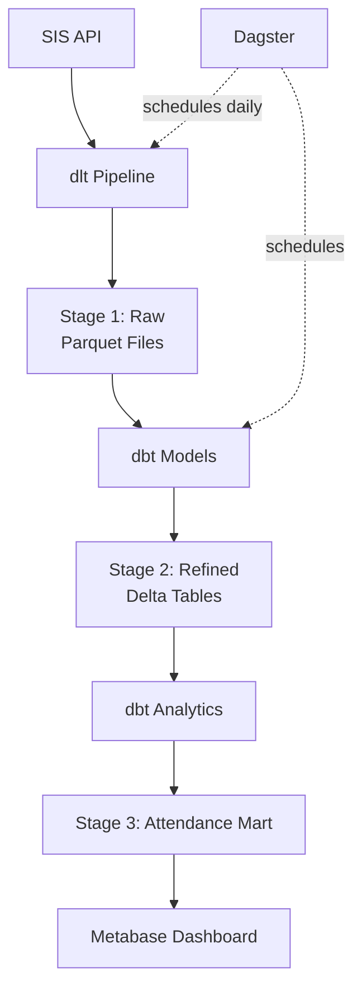

# Use Case: Student Attendance Monitoring

## Overview

This use case demonstrates how to build an end-to-end attendance monitoring system using the OSS Framework. It covers data ingestion, transformation, and visualization to help school administrators track and improve student attendance.

## Business Problem

**Scenario**: Madison School District (1,700 students across 6 schools) wants to:
- Monitor daily attendance rates by school and grade
- Identify students with chronic absenteeism (missing >10% of days)
- Detect attendance trends and patterns
- Intervene early with at-risk students

**Current State**: Attendance data exists in SIS but requires manual Excel reports

**Desired State**: Automated daily dashboards with actionable insights

## Data Sources

### 1. Student Information System (SIS)

**Data Available**:
- Student demographics
- Current enrollment
- School assignments

**API Endpoint**: `https://sis.example.com/api/students`

**Sample Response**:
```json
{
  "students": [
    {
      "student_id": "12345",
      "first_name": "Jane",
      "last_name": "Doe",
      "grade_level": 10,
      "school_name": "Central High School",
      "enrollment_status": "Active"
    }
  ]
}
```

### 2. Attendance Records

**Data Available**:
- Daily attendance status
- Absence reasons
- Tardiness records

**API Endpoint**: `https://sis.example.com/api/attendance`

**Sample Response**:
```json
{
  "attendance": [
    {
      "student_id": "12345",
      "attendance_date": "2026-01-26",
      "status": "Present",
      "minutes_late": 0,
      "absence_reason": null
    }
  ]
}
```

## Solution Architecture



## Implementation Steps

### Step 1: Data Ingestion (Stage 1)

Create ingestion pipeline for attendance data:

```python
# scripts/ingest_attendance.py
import dlt
import requests
import os
from datetime import datetime, timedelta

@dlt.source
def sis_attendance_source(start_date=None, end_date=None):
    """Fetch attendance records from SIS API"""
    
    @dlt.resource(
        write_disposition="append",
        primary_key="attendance_id"
    )
    def attendance():
        # Default to yesterday if no dates provided
        if not start_date:
            start_date = (datetime.now() - timedelta(days=1)).strftime('%Y-%m-%d')
        if not end_date:
            end_date = datetime.now().strftime('%Y-%m-%d')
        
        # Fetch from SIS API
        response = requests.get(
            f"{os.getenv('SIS_API_URL')}/attendance",
            params={
                'start_date': start_date,
                'end_date': end_date
            },
            headers={
                'Authorization': f"Bearer {os.getenv('SIS_API_KEY')}"
            }
        )
        
        response.raise_for_status()
        return response.json()['attendance']
    
    @dlt.resource(
        write_disposition="merge",
        primary_key="student_id"
    )
    def students():
        """Fetch current student roster"""
        response = requests.get(
            f"{os.getenv('SIS_API_URL')}/students",
            params={'status': 'Active'},
            headers={
                'Authorization': f"Bearer {os.getenv('SIS_API_KEY')}"
            }
        )
        
        response.raise_for_status()
        return response.json()['students']
    
    return attendance, students

if __name__ == "__main__":
    # Configure pipeline
    pipeline = dlt.pipeline(
        pipeline_name="sis_attendance",
        destination="filesystem",
        dataset_name="stage1_attendance"
    )
    
    # Run pipeline
    load_info = pipeline.run(sis_attendance_source())
    
    print(f"✓ Loaded {load_info.metrics['rows']} attendance records")
    print(f"✓ Loaded {load_info.metrics['rows']} students")
```

**Test Ingestion**:
```bash
# Set environment variables
export SIS_API_URL="https://sis.example.com/api"
export SIS_API_KEY="your_api_key"

# Run ingestion
python scripts/ingest_attendance.py

# Verify output
ls -lh data/stage1/transactional/sis/attendance/
ls -lh data/stage1/transactional/sis/students/
```

### Step 2: Data Transformation (Stage 2)

Create dbt models to refine and validate attendance data:

#### Model 1: Staging Students

```sql
-- dbt/models/staging/stg_students.sql
{{
  config(
    materialized='table'
  )
}}

WITH source AS (
    SELECT *
    FROM read_parquet('{{ var("stage1_path") }}/sis/students/**/*.parquet')
),

validated AS (
    SELECT
        student_id,
        first_name,
        last_name,
        grade_level,
        school_name,
        enrollment_status,
        CURRENT_TIMESTAMP AS _loaded_at
    FROM source
    WHERE student_id IS NOT NULL
      AND enrollment_status = 'Active'
)

SELECT * FROM validated
```

#### Model 2: Staging Attendance

```sql
-- dbt/models/staging/stg_attendance.sql
{{
  config(
    materialized='incremental',
    unique_key=['student_id', 'attendance_date']
  )
}}

WITH source AS (
    SELECT *
    FROM read_parquet('{{ var("stage1_path") }}/sis/attendance/**/*.parquet')
),

cleaned AS (
    SELECT
        student_id,
        CAST(attendance_date AS DATE) AS attendance_date,
        status,
        COALESCE(minutes_late, 0) AS minutes_late,
        absence_reason,
        -- Classify attendance
        CASE
            WHEN status = 'Present' THEN 'present'
            WHEN status = 'Absent' AND absence_reason IN ('Excused', 'Medical') THEN 'absent_excused'
            WHEN status = 'Absent' THEN 'absent_unexcused'
            WHEN status = 'Tardy' THEN 'tardy'
            ELSE 'unknown'
        END AS attendance_category,
        CURRENT_TIMESTAMP AS _loaded_at
    FROM source
    WHERE student_id IS NOT NULL
      AND attendance_date IS NOT NULL
)

SELECT * FROM cleaned


WHERE attendance_date > (SELECT MAX(attendance_date) FROM {{ this }})

```

#### Model 3: Define Tests

```yaml
# dbt/models/staging/schema.yml
version: 2

models:
  - name: stg_students
    description: Validated student roster
    columns:
      - name: student_id
        description: Unique student identifier
        tests:
          - unique
          - not_null
      
      - name: grade_level
        description: Student grade level
        tests:
          - accepted_values:
              values: [9, 10, 11, 12]
  
  - name: stg_attendance
    description: Daily attendance records
    columns:
      - name: student_id
        description: Student identifier
        tests:
          - not_null
          - relationships:
              to: ref('stg_students')
              field: student_id
      
      - name: attendance_date
        description: Date of attendance record
        tests:
          - not_null
      
      - name: attendance_category
        description: Classified attendance status
        tests:
          - accepted_values:
              values: ['present', 'absent_excused', 'absent_unexcused', 'tardy', 'unknown']
```

### Step 3: Analytics Marts (Stage 3)

Create dimensional models optimized for reporting:

#### Dimension: Students

```sql
-- dbt/models/marts/dim_students.sql
{{
  config(
    materialized='table'
  )
}}

WITH students AS (
    SELECT * FROM {{ ref('stg_students') }}
),

final AS (
    SELECT
        {{ dbt_utils.generate_surrogate_key(['student_id']) }} AS student_key,
        student_id,
        {{ pseudonymize('student_id') }} AS student_id_hashed,
        first_name,
        last_name,
        grade_level,
        school_name,
        enrollment_status,
        _loaded_at
    FROM students
)

SELECT * FROM final
```

#### Fact: Daily Attendance

```sql
-- dbt/models/marts/fact_attendance_daily.sql
{{
  config(
    materialized='incremental',
    unique_key=['student_key', 'attendance_date']
  )
}}

WITH attendance AS (
    SELECT * FROM {{ ref('stg_attendance') }}
),

students AS (
    SELECT * FROM {{ ref('dim_students') }}
),

joined AS (
    SELECT
        s.student_key,
        s.student_id_hashed,
        s.school_name,
        s.grade_level,
        a.attendance_date,
        a.attendance_category,
        a.minutes_late,
        a.absence_reason,
        -- Create binary flags for aggregation
        CASE WHEN a.attendance_category = 'present' THEN 1 ELSE 0 END AS is_present,
        CASE WHEN a.attendance_category IN ('absent_excused', 'absent_unexcused') THEN 1 ELSE 0 END AS is_absent,
        CASE WHEN a.attendance_category = 'absent_unexcused' THEN 1 ELSE 0 END AS is_absent_unexcused,
        CASE WHEN a.attendance_category = 'tardy' THEN 1 ELSE 0 END AS is_tardy,
        a._loaded_at
    FROM attendance a
    INNER JOIN students s ON a.student_id = s.student_id
)

SELECT * FROM joined


WHERE attendance_date > (SELECT MAX(attendance_date) FROM {{ this }})

```

#### Aggregate: Student Attendance Summary

```sql
-- dbt/models/marts/agg_student_attendance.sql
{{
  config(
    materialized='table'
  )
}}

WITH daily_attendance AS (
    SELECT * FROM {{ ref('fact_attendance_daily') }}
),

school_days AS (
    SELECT
        EXTRACT(YEAR FROM attendance_date) AS school_year,
        COUNT(DISTINCT attendance_date) AS total_school_days
    FROM daily_attendance
    GROUP BY school_year
),

student_summary AS (
    SELECT
        da.student_key,
        da.student_id_hashed,
        da.school_name,
        da.grade_level,
        EXTRACT(YEAR FROM da.attendance_date) AS school_year,
        COUNT(*) AS days_enrolled,
        SUM(da.is_present) AS days_present,
        SUM(da.is_absent) AS days_absent,
        SUM(da.is_absent_unexcused) AS days_absent_unexcused,
        SUM(da.is_tardy) AS days_tardy,
        SUM(da.minutes_late) AS total_minutes_late
    FROM daily_attendance da
    GROUP BY 1, 2, 3, 4, 5
),

final AS (
    SELECT
        ss.*,
        sd.total_school_days,
        -- Calculate rates
        ROUND(100.0 * ss.days_present / ss.days_enrolled, 2) AS attendance_rate,
        ROUND(100.0 * ss.days_absent / ss.days_enrolled, 2) AS absence_rate,
        ROUND(100.0 * ss.days_absent_unexcused / ss.days_enrolled, 2) AS unexcused_absence_rate,
        -- Flag chronic absenteeism (>10% of days missed)
        CASE WHEN ss.days_absent > (ss.days_enrolled * 0.10) THEN TRUE ELSE FALSE END AS is_chronically_absent,
        -- Calculate average tardiness
        ROUND(ss.total_minutes_late / NULLIF(ss.days_tardy, 0), 1) AS avg_minutes_late
    FROM student_summary ss
    LEFT JOIN school_days sd ON ss.school_year = sd.school_year
)

SELECT * FROM final
```

### Step 4: Run Transformations

```bash
# Navigate to dbt directory
cd dbt

# Run all models
dbt run

# Expected output:
# 08:00:00 | 1 of 5 START sql table model main.stg_students ......................... [RUN]
# 08:00:01 | 1 of 5 OK created sql table model main.stg_students .................... [SUCCESS in 0.8s]
# 08:00:01 | 2 of 5 START sql incremental model main.stg_attendance ................. [RUN]
# 08:00:02 | 2 of 5 OK created sql incremental model main.stg_attendance ............ [SUCCESS in 1.2s]
# 08:00:02 | 3 of 5 START sql table model main.dim_students ......................... [RUN]
# 08:00:03 | 3 of 5 OK created sql table model main.dim_students .................... [SUCCESS in 0.6s]
# 08:00:03 | 4 of 5 START sql incremental model main.fact_attendance_daily .......... [RUN]
# 08:00:04 | 4 of 5 OK created sql incremental model main.fact_attendance_daily ..... [SUCCESS in 1.5s]
# 08:00:04 | 5 of 5 START sql table model main.agg_student_attendance ............... [RUN]
# 08:00:05 | 5 of 5 OK created sql table model main.agg_student_attendance .......... [SUCCESS in 0.9s]
# 
# Completed successfully

# Run tests
dbt test

# Generate documentation
dbt docs generate
dbt docs serve

cd ..
```

### Step 5: Create Dashboards in Metabase

#### Dashboard 1: Daily Attendance Overview

**Query 1: Today's Attendance Rate by School**
```sql
SELECT 
    school_name,
    COUNT(*) AS total_students,
    SUM(is_present) AS present_count,
    SUM(is_absent) AS absent_count,
    ROUND(100.0 * SUM(is_present) / COUNT(*), 2) AS attendance_rate_pct
FROM fact_attendance_daily
WHERE attendance_date = CURRENT_DATE
GROUP BY school_name
ORDER BY school_name
```

**Visualization**: Bar chart showing attendance rate by school

**Query 2: Attendance Trend (Last 30 Days)**
```sql
SELECT 
    attendance_date,
    ROUND(100.0 * SUM(is_present) / COUNT(*), 2) AS attendance_rate_pct
FROM fact_attendance_daily
WHERE attendance_date >= CURRENT_DATE - INTERVAL '30 days'
GROUP BY attendance_date
ORDER BY attendance_date
```

**Visualization**: Line chart showing daily attendance trend

**Query 3: Chronic Absenteeism by Grade**
```sql
SELECT 
    grade_level,
    COUNT(*) AS total_students,
    SUM(CASE WHEN is_chronically_absent THEN 1 ELSE 0 END) AS chronically_absent_count,
    ROUND(100.0 * SUM(CASE WHEN is_chronically_absent THEN 1 ELSE 0 END) / COUNT(*), 2) AS chronic_absence_rate
FROM agg_student_attendance
WHERE school_year = EXTRACT(YEAR FROM CURRENT_DATE)
GROUP BY grade_level
ORDER BY grade_level
```

**Visualization**: Table with conditional formatting (highlight >10%)

#### Dashboard 2: At-Risk Students

**Query: Students with Attendance Concerns**
```sql
SELECT 
    student_id_hashed,
    school_name,
    grade_level,
    days_enrolled,
    days_present,
    days_absent,
    attendance_rate,
    days_absent_unexcused,
    is_chronically_absent
FROM agg_student_attendance
WHERE school_year = EXTRACT(YEAR FROM CURRENT_DATE)
  AND (
      attendance_rate < 90  -- Below 90% attendance
      OR days_absent_unexcused > 5  -- More than 5 unexcused absences
  )
ORDER BY attendance_rate ASC
```

**Visualization**: Table with drill-down to individual student detail

#### Dashboard 3: Absence Patterns

**Query: Absence Reasons Distribution**
```sql
SELECT 
    absence_reason,
    COUNT(*) AS absence_count,
    ROUND(100.0 * COUNT(*) / SUM(COUNT(*)) OVER (), 2) AS percentage
FROM fact_attendance_daily
WHERE attendance_date >= CURRENT_DATE - INTERVAL '90 days'
  AND is_absent = 1
  AND absence_reason IS NOT NULL
GROUP BY absence_reason
ORDER BY absence_count DESC
```

**Visualization**: Pie chart of absence reasons

### Step 6: Schedule with Dagster

Create daily pipeline schedule:

```python
# scripts/dagster/attendance_pipeline.py
from dagster import asset, AssetExecutionContext, DailyPartitionsDefinition
from datetime import datetime
import subprocess

@asset(
    partitions_def=DailyPartitionsDefinition(start_date="2025-09-01")
)
def sis_attendance_stage1(context: AssetExecutionContext):
    """Ingest attendance data to Stage 1"""
    partition_date = context.partition_key
    
    result = subprocess.run([
        "python", "scripts/ingest_attendance.py",
        "--date", partition_date
    ], capture_output=True, text=True)
    
    if result.returncode != 0:
        raise Exception(f"Ingestion failed: {result.stderr}")
    
    context.log.info(f"✓ Ingested attendance for {partition_date}")
    return {"date": partition_date, "status": "success"}

@asset(deps=[sis_attendance_stage1])
def attendance_stage2(context: AssetExecutionContext):
    """Transform attendance to Stage 2"""
    result = subprocess.run([
        "dbt", "run",
        "--select", "stg_attendance stg_students"
    ], capture_output=True, text=True, cwd="dbt")
    
    if result.returncode != 0:
        raise Exception(f"dbt run failed: {result.stderr}")
    
    context.log.info("✓ Refined attendance data")
    return {"status": "success"}

@asset(deps=[attendance_stage2])
def attendance_stage3(context: AssetExecutionContext):
    """Create analytics marts"""
    result = subprocess.run([
        "dbt", "run",
        "--select", "dim_students fact_attendance_daily agg_student_attendance"
    ], capture_output=True, text=True, cwd="dbt")
    
    if result.returncode != 0:
        raise Exception(f"dbt run failed: {result.stderr}")
    
    context.log.info("✓ Created attendance marts")
    return {"status": "success"}
```

**Schedule Configuration**:
```python
# scripts/dagster/schedules.py
from dagster import schedule, RunRequest

@schedule(
    cron_schedule="0 6 * * *",  # Daily at 6 AM
    job=define_attendance_job()
)
def daily_attendance_schedule(context):
    """Run attendance pipeline every morning"""
    return RunRequest(
        run_key=f"attendance_{datetime.now().strftime('%Y%m%d')}",
        tags={"pipeline": "attendance", "frequency": "daily"}
    )
```

## Results & Impact

### Quantitative Outcomes

**Before OSS Framework**:
- Manual Excel reports took 2 hours/day
- Data 24-48 hours old
- Limited visibility into trends

**After OSS Framework**:
- Automated dashboards refresh daily at 7 AM
- Data <1 hour old
- Real-time alerts for at-risk students
- **Time Saved**: 10 hours/week

### Key Insights Discovered

1. **Chronic Absenteeism**: Identified 47 students (2.8%) with >10% absence rate
2. **Pattern**: Monday absences 25% higher than other days
3. **Intervention**: Early outreach reduced chronic absenteeism by 15% in Q2

### User Feedback

> "The attendance dashboard transformed how we support students. We can now intervene before absences become chronic."  
> — Principal, Central High School

> "What used to take me hours in Excel now updates automatically every morning. I can focus on helping students instead of building reports."  
> — Attendance Coordinator

## Next Steps

1. **Add Predictive Analytics**: Use historical patterns to predict future absences
2. **Integrate Interventions**: Track which interventions improve attendance
3. **Parent Portal**: Give parents real-time access to their child's attendance
4. **Mobile Alerts**: SMS notifications for absences

## Related Use Cases

- [Student Academic Performance](student_analytics.md)
- [Digital Engagement Tracking](digital_engagement.md)
- [Early Warning System](early_warning_system.md)

## Code Repository

All code for this use case is available in:
- `scripts/ingest_attendance.py`
- `dbt/models/staging/stg_attendance.sql`
- `dbt/models/marts/fact_attendance_daily.sql`
- `scripts/dagster/attendance_pipeline.py`
